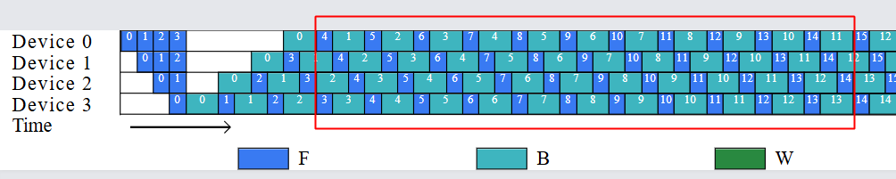
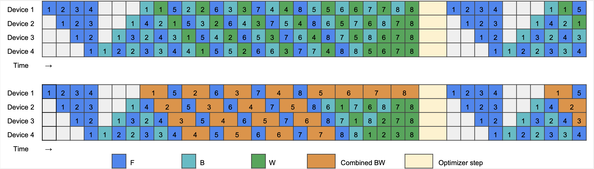
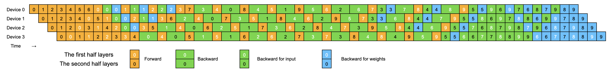

# 用几何和代数方法理解流水线并行：从1F1B到DualPipe

## 简介

流水线并行（Pipeline Parallelism）是大模型分布式训练中的核心技术之一，它将模型的不同层分配到不同的计算设备上，通过微批次（microbatch）的流水线化执行来提高设备利用率和训练吞吐量。然而，如何设计高效的流水线调度策略以最小化空闲时间（bubble）和显存占用，一直是该领域的研究热点。

本文从几何直观和代数推导两个维度，系统梳理了流水线并行调度策略的演进脉络：从经典的1F1B（One Forward One Backward）调度，到ZB-H1/ZB-H2的细粒度反向拆分优化，再到DeepSeek-V3中提出的DualPipe及其变体DualPipeV。通过统一的分析框架，揭示不同调度策略背后的设计原理和数学规律。

本文适合对分布式训练有一定了解的读者阅读，需要熟悉基本的流水线并行概念（如microbatch、stage、forward/backward计算等）。阅读本文后，你将能够：
- 理解主流流水线调度策略的核心设计思想
- 掌握用几何方法和代数方法分析调度规律的技巧
- 理解不同调度策略在显存占用和bubble时间上的权衡

## 1F1B

1F1B是人工设计的流水线调度。下面是pipeline parallel（简写p）=4, micro batch number（简写m）=8的示意图


对于这类没有virtual device的调度，有通用规则，即必须满足：

1. 单batch的stage内顺序：对于某1个microbatch，在某1个stage内，必须遵循 F B(W)的顺序。如图中，对于microbatch0，device0上，蓝色的F在前，青色的B（包含B、W）在后。
2. 多batch的stage内顺序：在某个stage内，同样的计算单元，小的micro batch序号都在大序号前面。比如在device 2上，计算单元F按序号0-7排列，计算单元B也按序号0-7排列。
3. 单batch的跨stage顺序：对于某1个microbatch，在前向时，后一个stage必须等前一个stage结束，而反向时，前一个stage必须等后一个stage结束。

对于1F1B来说，除了满足上面通用规则，还有特有的规则。可以观察它的稳态阶段的一部分，即图中的红框，规则如下：

1. FB交错出现：各个stage上，F和B交错出现，即 (F, B) x N
2. FB序号关系：对于最后一个stage3（即Device 3），前向F 和 反向B 是同1个microbatch，有相同的microbatch id序号。每往前一个stage，前向F的microbatch id比反向B的microbatch id加1，成等差数列。如stage3中是 F4后紧跟B4，记作(F4, B4)。而 stage2中是 (F4, B3)，stage1中是 (F4,B2)，stage0中是 (F4, B1) 。一般地，对于stage i，计算对为  `(Fx, Bx-(p-1-i))`

其中规则2中的序号关系又是1F1B的重点特征，这本质上是为了控制第一个stage0上占用的显存。具体做法是最多只能驻留p=4大小的micro batch做F，即图中的F0,F1,F2,F3，由于他们4个都没做反向，所以中间结果（激活值）都必须占用显存不能释放。

由此也可以算出1F1B占用的峰值显存。假设一个microbatch中间结果占用的显存为 $M_{B}$，那么1F1B在stage0上占用的显存最多，其峰值显存为 $pM_B$。

如果不做流水线并行，一个microbatch中间结果占用显存为 $M_{B}^{all}$，那么做1F1B流水线并行后，中间结果的峰值显存会变小吗？

答案是不会变小。这是因为虽然切分layer后，一个mircobatch中间结果变为原来的 $\frac{1}{p}$，即 $M_{B}=M_{B}^{all} / p$。但是像前面说明的，1F1B为了减少气泡同时驻留了p个microbatch的中间结果，所以总的中间结果显存和原来相同，仍为$p*M_B=M_B^{all}$。

除了稳态阶段外，1F1B还有前面的warmup阶段和后面的cooldown阶段，他们有什么规律呢？有多种方法找到这个规律。

方法一：通过几何方法来找规律，前后扩充法。

原来micro batch number=8，假设micro batch向前扩充了4个，向后扩充了6个，变为18个，如下图。


但是我们只关注 micro id=4~11的8个micro batch，如下。



然后剔除不属于4~11范围的microbatch


这样就得到了和图1相同的microbatch=8的调度策略。

在warmup阶段看剔除的规律：就是最后一个stage p-1不剔除，从它往上每个stage多剔除一个B。即stage i 剔除 `p-1-i`。这就是stage i在warmup阶段完成的F个数。

方法二：代数法。直接根据上面稳态阶段的规律（即 1F1B特有规则2：FB序号关系），可以知道，stage p-1 上第1个稳态计算对为 `(F0, B0)`，stage p-2 上为 `(F1, B0)`，stage p-3上为 `(F2, B0)`，…，stage 1上为 `(Fp-2, B0)`，stage 0上为 `(Fp-1, B0)`。对于stage i，计算对为  `(Fx-(p-1-i), Bx)`。

根据通用规则2（多batch的stage内顺序），可以知道每个stage都必须完成前面micro序号的F计算。即 stage i 在warmup阶段需要完成 `p-1-i` 个F计算单元。

同理，在cooldown阶段，stage i需要完成 p-1-i个B计算单元。

### 1F1B的Megatron代码实现

在[Megatron 1F1B 实现](https://github.com/NVIDIA/Megatron-LM/blob/861a8fa2d521761c435b69ccbe022511f7713d45/megatron/core/pipeline_parallel/schedules.py#L1827)中可以看到上述规律，核心代码如下

```python
def forward_backward_pipelining_without_interleaving():
    # Compute number of warmup microbatches.
    num_warmup_microbatches = (
        parallel_state.get_pipeline_model_parallel_world_size()
        - parallel_state.get_pipeline_model_parallel_rank()
        - 1
    )
    num_warmup_microbatches = min(num_warmup_microbatches, num_microbatches)
    num_microbatches_remaining = num_microbatches - num_warmup_microbatches
    # Run warmup forward passes.
    for i in range(num_warmup_microbatches):
        input_tensor = recv_forward(
            recv_tensor_shapes, config, parallel_state.is_pipeline_first_stage()
        )
        output_tensor, num_tokens = forward_step(
            forward_step_func,
            data_iterator,
            model,
            num_microbatches,
            input_tensor,
            forward_data_store,
            config,
            collect_non_loss_data,
            checkpoint_activations_microbatch,
            check_first_val_step(first_val_step, forward_only, i == 0),
            current_microbatch=i,
            encoder_decoder_xattn=encoder_decoder_xattn,
        )
        send_forward(
            output_tensor, send_tensor_shapes, config, parallel_state.is_pipeline_last_stage()
        )
    # Run 1F1B in steady state.
    for i in range(num_microbatches_remaining):
        output_tensor, num_tokens = forward_step(
            forward_step_func,
            data_iterator,
            model,
            num_microbatches,
            input_tensor,
            forward_data_store,
            config,
            collect_non_loss_data,
            checkpoint_activations_microbatch,
            check_first_val_step(
                first_val_step, forward_only, (i == 0) and (num_warmup_microbatches == 0)
            ),
            current_microbatch=i + num_warmup_microbatches,
            encoder_decoder_xattn=encoder_decoder_xattn,
        )

        if not forward_only:
            output_tensor_grad = send_forward_recv_backward(
                output_tensor, send_tensor_shapes, config, parallel_state.is_pipeline_last_stage()
            )
            input_tensor_grad = backward_step(
                input_tensor, output_tensor, output_tensor_grad, model_type, config
            )

            if last_iteration:
                input_tensor = None
                send_backward(
                    input_tensor_grad,
                    recv_tensor_shapes,
                    config,
                    parallel_state.is_pipeline_first_stage(),
                )
            else:
                input_tensor = send_backward_recv_forward(
                    input_tensor_grad,
                    recv_tensor_shapes,
                    config,
                    parallel_state.is_pipeline_first_stage(),
                )
    # Run cooldown backward passes.
    if not forward_only:
        for i in range(num_warmup_microbatches):

            # Enable async grad reduction in the last backward pass
            # Note: If grad sync function is provided, only enable
            # async grad reduction in first pipeline stage. Other
            # pipeline stages do grad reduction during pipeline
            # bubble.
            if i == num_warmup_microbatches - 1:
                if config.grad_sync_func is None or rank == 0:
                    enable_grad_sync()

            input_tensor = input_tensors.pop(0)
            output_tensor = output_tensors.pop(0)

            output_tensor_grad = recv_backward(
                send_tensor_shapes, config, parallel_state.is_pipeline_last_stage()
            )

            input_tensor_grad = backward_step(
                input_tensor, output_tensor, output_tensor_grad, model_type, config
            )

            send_backward(
                input_tensor_grad,
                recv_tensor_shapes,
                config,
                parallel_state.is_pipeline_first_stage(),
            )
```

## ZB-H1
为了理解DualPipe的做法，需要先了解一系列zero bubble流水线并行的策略。首先是ZB-H1，它的核心思路是：

- 将反向整体的B拆成，针对输入的反向B和针对参数的反向W。优先调度F和B。这样B反向后立即传给下一个stage，不用等待W，W可以放置在任意需要填充bubble的位置。这样整体的时间缩短了，bubble减少了。
- 另外，在stage0调度时，同样保证最多驻留p个F，这样与1F1B有相同的峰值显存 $pM_B$。

通用规则，与1F1B类似，增加一条W规则是：W只依赖同stage内对应的B。

p(pipeline parallel)=4, m(micro batch number)=8的ZB-H1如下


ZB-H1稳态阶段的特有规则：

1. FBW交错
2. 序号关系：对于最后一个stage3为 `(F4, B4, W1)`，stage2为`（F4, B3, W1）`，stage1为`（F4, B2, W1）`，stage0为`（F4, B1, W1）`。即stage i 上计算对为 `(Fx, Bx-(p-1-i), Wx-(p-1))`。其中B的序号随变量stage i成等差序列。

解释这个序号关系的原因：与1F1B一样，为了保证stage0上最多驻留p个F块，形成了上面这样的序号关系。

找warmup和cooldown的规律。

方法一：扩充法。

和前面类似，根据稳态规则扩充到18个microbatch，但只看micro id=4~11的8个micro batch。


方法二：代数法。

稳态时计算对中：F的序号 `fi=x ≥ bi = x-p+1+i ≥ wi=x-p+1`。

所以 `(Fx, Bx-(p-1-i), Wx-(p-1))` 在warmup阶段会先后出现`(Fx, , )`和 `(Fx, Bx-(p-1-i), )` 的情况。

在 `(Fx, , )` 的warmup1阶段，bi 和 wi 都无法到0，所以只有Fx。

在  `(Fx, Bx-(p-1-i), )` 的warmup2阶段，bi ≥ 0，但是wi仍然小于0。

warmup1阶段：

根据 `0 > bi ≥ wi` 得到 `x < p-1-i` ，表示 stage i 中单独的F `(Fx, , )` 有 p-1-i个。

warmup2阶段：

根据 `bi ≥ 0 > wi` 得到 `p-1-i ≤ x < p-1`，表示stage i中 `(Fx, Bx-(p-1-i), )`  有 (p-1) - (p-1-i)=i个。

类似地，在cooldown阶段会先后出现 `（, Bx-(p-1-i), Wx-(p-1)）`和 `（, , Wx-(p-1)）`的情况。

cooldown1阶段：

根据  `fi ≥ m > bi ≥ wi`，得到  `m+p-1-i > x ≥ m` ，表示 stage i中 `（, Bx-(p-1-i), Wx-(p-1)）`有 (m+p-1-i) - m = p-1-i 个。

cooldown2阶段：

根据 `fi ≥ bi ≥ m > wi`，得到    `m+p-1 > x ≥ m+p-1-i`，表示stage i中 `（, , Wx-(p-1)）`有 (m+p-1) - (m+p-1-i)=i 个。

作者在实现 ZB-H1时，实际是实现了一个上面ZB-H1的变种，见 [代码](https://github.com/sail-sg/zero-bubble-pipeline-parallelism/tree/zb-h1-quick-start) 。这个变种尽量不修改整个的(BW)，如下图。好处，一个是可以在Megatron上做更少的修改，另一个是在TP并行同时开启时可以利用Megatron中已经实现的TP反向的通信重叠策略，即 [图解Megatron TP中的计算通信overlap](https://zhuanlan.zhihu.com/p/16594218518) 文章中第4节介绍的重叠策略。



### ZB-H1的代码实现

warmup1阶段代码体现在原作者的[这段代码](https://github.com/sail-sg/zero-bubble-pipeline-parallelism/blob/c5d5074132dd47aec5a92b8753a56d808a109eda/megatron/core/pipeline_parallel/schedules.py#L1157)，主要逻辑如下

```python
    num_warmup_microbatches = (
        parallel_state.get_pipeline_model_parallel_world_size()
        - parallel_state.get_pipeline_model_parallel_rank()
        - 1
    )
    # Run warmup forward passes.
    for i in range(num_warmup_microbatches):
        output_tensor = forward_step(
            forward_step_func,
            data_iterator,
            model,
            num_microbatches,
            input_tensor,
            forward_data_store,
            config,
            collect_non_loss_data,
            checkpoint_activations_microbatch,
        )
```

warmup2 作者实现时，混入到了steady阶段中的反向过程中，见[此代码](https://github.com/sail-sg/zero-bubble-pipeline-parallelism/blob/c5d5074132dd47aec5a92b8753a56d808a109eda/megatron/core/pipeline_parallel/schedules.py#L1249)，主要逻辑如下

```python
    # Run 1F1B in steady state.
    for i in range(num_microbatches_remaining):
        output_tensor = forward_step(
            forward_step_func,
            data_iterator,
            model,
            num_microbatches,
            input_tensor,
            forward_data_store,
            config,
            collect_non_loss_data,
            checkpoint_activations_microbatch,
        )
        if not forward_only:
            # For BWF pattern or in rank 0, we don't split W and B for reasons below.
            #   1. to leverage batched p2p op (send_backward_recv_forward)
            #   2. to overlap grad all-reduce for tensor parallel
            #   3. to avoid redoing grad all-gather for sequence parallel
            # Note that the order of grad accumulation is changed by this behavior,
            # thus causing a minor precision error compared to 1F1B even it's mathematically correct.
            # warmup2阶段公式中的 x = i + p-rank-1
            # 根据 p-1-rank ≤ x <p-1
            # p-1-rank ≤ i + p-rank-1 < p-1
            # 即 0 ≤ i < rank
            # 这里 split_bw 就表示只做B，不做W
            WeightGradStore.split_bw = (i < rank or last_iteration) and rank > 0
            input_tensor_grad = backward_step(
                input_tensor, output_tensor, output_tensor_grad, model_type, config
            )
            if WeightGradStore.split_bw:
                WeightGradStore.flush()
```

cooldown1的[代码](https://github.com/sail-sg/zero-bubble-pipeline-parallelism/blob/c5d5074132dd47aec5a92b8753a56d808a109eda/megatron/core/pipeline_parallel/schedules.py#L1268)，核心逻辑

```python
        for i in range(num_warmup_microbatches):
            WeightGradStore.split_bw = rank > 0
            input_tensor_grad = backward_step(
                input_tensor, output_tensor, output_tensor_grad, model_type, config
            )
            if WeightGradStore.split_bw:
                WeightGradStore.flush()
                if num_microbatches_remaining + i >= rank:
                    WeightGradStore.pop()  # W
```

cooldown2的[代码](https://github.com/sail-sg/zero-bubble-pipeline-parallelism/blob/c5d5074132dd47aec5a92b8753a56d808a109eda/megatron/core/pipeline_parallel/schedules.py#L1295)，核心逻辑

```python
        WeightGradStore.pop_all()  # W
```

## ZB-H2


ZB-H2与ZB-H1都做了BW的分离，而他们核心的不同是：在warmup阶段，不受显存的约束，尽可能地调度更多的F，从而减少气泡。实际上可以计算，中间激活值 显存占用约为 1F1B的2倍，即 $2pM_B$，这也是命名H2的原因。

ZB-H2 序号关系：稳态阶段，计算对为`（Fx, Bx-2(p-1-i), Wx-2(p-1)）`。

其中F、B、W的序号大小关系为： `fi=x ≥ bi=x-2(p-1-i) ≥ wi=x-2(p-1)`。

warmup1阶段：`0 > bi ≥ wi`

得到 `2(p-1-i) > x ≥ 0`  ，共 `2(p-1-i)` 个 (Fx, ,)

warmup2阶段：`bi ≥ 0 > wi`

得到  `2(p-1) > x ≥ 2(p-1-i)`，共 `2(p-1) - 2(p-1-i)=2i`个 `(Fx, Bx-2(p-1-i), )`

cooldown1阶段：`x ≥ m > bi`

得到  `m+2(p-1-i) > x ≥ m`，共 `2(p-1-i)` 个  `(, Bx-2(p-1-i), Wx-2(p-1)）`

cooldown2阶段：`bi ≥ m > wi`，

得到   `m+2(p-1) > x ≥ m+2(p-1-i)`，共 2i 个  `(, , Wx-2(p-1)）`

## DualPipe

这是一个DualPipe p=8, m=20的例子。


DualPipe 使用了双向的调度，也就是从流水线的两端（device0 和device p-1）同时喂入micro batch数据，从正向喂入10个micro batch（图中micro id序号0-9黑字），从反向喂入10个micro batch（图中micro id 序号 0-9白字）。
这个做法要求DualPipe存储两份参数，一份参数从device 0到device p-1分布（这里称为 model chunk0），另一份参数从device p-1到device 0分布（model chunk1）。

这么做的原因是，要组成一个 `(F0, B1, F1, B0)` 的稳态阶段，在这个阶段中，可以做前向、反向的通信计算重叠，来隐藏耗时的ep all to all通信，示意图如下，来自[deepseek开源的profile](https://github.com/deepseek-ai/profile-data)。但是代价是参数占用显存扩大了一倍。


由于DualPipe 里 1个GPU(也叫device)上放置2个model chunk。所以有时也说1个物理device被当做了2个virtual device。这两个叫法是一回事。

由于1个device上放置2个model chunk，导致前面1F1B类型的通用规则和特有规则都发生了变化。

virtual device类型调度策略的通用规则如下：

1. 单batch的stage内顺序：对于某1个model chunk的某1个microbatch，在某1个device(stage)内，必须遵循 F B W的顺序。如图中，对于modelchunk0（从上往下分布的模型分片，用黑字microbatch id表示），microbatch0，device0上，橙色的F在前，绿色的B、蓝色的W在后。
2. 多batch的stage内顺序：在某个stage内，同样的计算单元model chunk，小的micro batch序号都在大序号前面。比如model chunk0在device 2上，计算单元F按序号0-9排列，计算单元B也按序号0-9排列。
3. 单batch的跨stage顺序：对于某1个model chunk的某1个microbatch，在前向时，后一个stage必须等前一个stage结束，而反向时，前一个stage必须等后一个stage结束。其中model chunk0和chunk1的前后stage定义正好相反
    1. 对于正向顺序放置的model chunk0，stage i的前一个stage为 stage i-1，后一个stage为 stage i+1
    2. 对于反向顺序放置的model chunk1，stage i的前一个stage为stage i+1，后一个stage为 stage i-1

对于DualPipe来说，除了满足上面通用规则，还有特有的规则。可以观察它的稳态阶段的一部分，即图中的红框，规则如下：

1. 不同model chunk的FB交错出现：各个stage上，不同model chunk的F和B交错出现，即 `(F0, B1, F1, B0)` x N。其中F0表示model chunk0的前向，F1表示model chunk1的前向。
2. FB序号关系：看上图，稳态中挑选`F0_8`（0表示modelchunk0，8表示micro batch id为8）所在的计算对，有
    1. stage0中为 `(F0_8, B1_4, F1_5, B0_1)`
    2. stage1中为 `(F0_8, B1_4, F1_6, B0_2)`
    3. stage2中为 `(F0_8, B1_4, F1_7, B0_3)`
    4. stage3中为 `(F0_8, B1_4, F1_8, B0_4)`
    5. stage4中为 `(F0_8, B1_4, F1_9, B0_5)`
    6. stage5~7由于micro batch number太小，超出了稳态范围，进入cooldown状态
    7. 由于DualPipe上下对称，我们只分析上半部分，下半部分对称得到相关结果即可。
    8. 可以看到F0和B1的序号固定相差 p/2=4，而F1和B0则随stage i成等差数列。根据等差数据的某一项以及公差，很容易推导出，stage i中序号关系是  `(F0_x, B1_(x-p/2), F1_(x-p/2+1+i), B0_(x-p+1+i))` 
3. F的起始限制：仍然只考虑上半部分，由于 F1 从下半部分往上传递，较晚到达上层，即在起始warmup阶段，`F1_0`要滞后`F0_0`一段时间。具体地，对于stage i，micro id=0的`F1_0`要晚于`F0_0`的时间为 `p-1-2i` 个单位时间。

我们分析 `(F0, B1, F1, B0)` 的序号`f0_i, b1_i, f1_i, b0_i` 大小关系为：

`f0_i=x > f1_i=x-p/2+1+i > b1_i=x-p/2 ≥ b0_i=x-p+1+i`

注意， `b1_i ≥ b0_i`，是因为我们只分析上半部分，即  $i \in [0, p/2-1]$

下面分析warmup和cooldown阶段，对于任意 stage i 有：

warmup1： `f0_i ≥ 0 > f1_i > b1_i ≥ b0_i` 

得到  `p/2 - 1 - i > x ≥ 0`，故 `(F0, , , )` 有 `p/2 - 1 - i`个。

warmup2：`f0_i > f1_i ≥ 0 > b1_i ≥ b0_i` 

得到   `p/2 > x ≥ p/2 - 1 - i`，故  `(F0, , F1,)` 有 `1+i` 个。

warmup 3： `f0_i > f1_i > b1_i ≥ 0 > b0_i`

得到  `p-1-i > x ≥ p/2` ，故 `(F0, B1, F1, )` 有 `p/2 - 1 - i` 个。

总共有 F0 为 `p-i-1` 个。

有一个小优化，是压缩warmup阶段的气泡。

上面分析的warmup阶段的方案也是可行的一种方案。

但是考虑到DualPipe特有规则3（F的起始限制），对任一stage i上，`F1_0`要在`p-1-2i`个单位时间后才能到达，但是warmup1在`p/2-1-i`个单位时间后就结束了。要做 warmup 2的 (F0, ,F1,) 就要继续等待 `p/2-1-i` 个单位时间。由此产生了bubble。

为了压缩bubble，可以将 warmup 1~3阶段的 F0 提前来做填充，由此产生了下面的warmup方案：

warmup1：`(F0, , , )` 做 `p - 2 - 2i`个，用来等待第一个`F1_0`的到来。

warmup2:  `(F0, , F1,)` 做 `1+i` 个，至此warmup阶段的F已全部用完。

warmup3:  `(F0, B1, F1, )` 退化为 `(, B1, F1, )`，做  `p/2 - 1 - i` 个。

这就是上图中DeepSeek官方实现的DualPipe方案。这个方案相比原始方案，减少了warmup的bubble，但是代价是stage0要驻留多1倍的F计算块，因而中间激活值占用的内存也多了1倍。

cooldown阶段可以类似分析，会逐步做  `(, B1, F1, B0)` 、 `(, B1, , B0)`  和  `(, , , B0)` 。这部分可以参考下一节DualPipeV中的内容。

稳态阶段 `(F0, B1, F1, B0)` 的个数，可以统计F0得到。F0总共有 `m_half=m/2`个，warmup阶段消耗掉 p-i-1个。故稳态阶段有 `m/2 - p + i + 1` 个。 

### DualPipe的代码实现

[官方代码](https://github.com/deepseek-ai/DualPipe/blob/3da1bbea53606543d7f5f232338fc58096db30e3/dualpipe/dualpipe.py#L358)实现的很清晰，可以直接和上面的分析对照。核心逻辑如下。

```python
    def step(
        self,
        *inputs: Optional[torch.Tensor],
        num_chunks: int = 0,
        criterion: Optional[Callable] = None,
        labels: List[Optional[torch.Tensor]] = [],
        return_outputs: bool = False,
    ) -> Tuple[Optional[torch.Tensor], Optional[Union[torch.Tensor, Tuple[torch.Tensor]]]]:
    
        # For the first half of the ranks: phase 0 means forward direction, phase 1 means reverse direction.
        # For the second half of the ranks: phase 0 means reverse direction, phase 1 means forward direction.

        # Step 1: nF0
        # For example, num_ranks=8, num_chunks=20, as depicted in the figure 5 of the DeepSeekV3 paper.
        # when rank=0,   (4 - 0 - 1)*2=6
        step_1 = (num_half_ranks - half_rank - 1) * 2
        for i in range(step_1):
            self._forward_chunk(0)
            
        # Step 2: nF0F1
        # when rank=0, 0 + 1 = 1
        step_2 = half_rank + 1
        self._recv_forward(0)
        for i in range(step_2):
            self._forward_chunk(0, recv=False, send=self.is_middle_rank)
            self._recv_forward(0)
            self._forward_chunk(1, send=(not self.is_middle_rank) or (i < step_2 - 1))
            if not self.is_middle_rank:
                self._send_forward(0)
                
        # Step 3: nB1W1F1 (Use zero bubble)
        # when rank=0, 4 - 0 - 1 = 3
        step_3 = num_half_ranks - half_rank - 1
        for i in range(step_3):
            # 在这里启用zero bubble (enable_zb=True)是为了优化计算和通信的重叠
            # zero bubble技术先做激活反向，做完即开始传递梯度
            # 然后接着将权重反向和recv F做通信计算重叠
            # 这样可以减少pipeline bubble（流水线中的空闲时间），提高GPU利用率
            self._backward_chunk(1, enable_zb=True)
            self._recv_forward(1)
            self._weight_chunk()
            self._forward_chunk(1, recv=False)

        # Step 4 (Main step): nF0B1F1B0
        # when rank=0, 20/2 - 8 + 0 + 1 = 3
        step_4 = half_num_chunks - num_ranks + half_rank + 1
        for i in range(step_4):
            if i == 0:
                if self.is_middle_rank:
                    # NOTE: We don't overlap these two chunks to further reduce bubble size.
                    self._forward_chunk(0, recv=False, send=False)
                    self._send_forward(1)
                    self._backward_chunk(1, send=False)
                    self._send_forward(0)
                    self._send_backward(1)
                else:
                    self._forward_backward_chunk(0, 1, recv0=False)
            else:
                # F0B1
                self._forward_backward_chunk(0, 1)
            # F1B0
            self._forward_backward_chunk(1, 0)
        
        # cool down 操作省略
```

其中需要注意，warmup 3阶段使用了ZB-H1中提到的BW分离技术，目的是为了做通信计算重叠，同时加速反向计算块结果传递给下一个stage，对应代码已经注释说明。

最后，值得一提的是，前面分析时提到只分析上半部分，下半部分对称得到相关结果即可。这个对称操作如下，分布在各种需要使用phase的函数里，比如 [`_forward_backward_compute_chunk`函数](https://github.com/deepseek-ai/DualPipe/blob/3da1bbea53606543d7f5f232338fc58096db30e3/dualpipe/dualpipe.py#L132)中

```python
phase0 ^= self.is_in_second_half
phase1 ^= self.is_in_second_half
```

## DualPipeV

Zero Bubble的作者基于DualPipe又提出了DualPipeV的改进，见作者[博客](https://hackmd.io/@ufotalent/S1N_ay0ckx)。

DualPipeV 在 p=4, m=10的例子如下


通过仅保留前半部分的设备（并将从下至向上的microbatch的后半段接到从上至下的microbatch的前半段），可以获得一个不含“双向”部分的调度方案，该方案不再有参数重复所以参数显存占用减半，同时保持与原始方案相同的气泡率、中间激活内存占用等属性。

代价是 PP 通信量是其他方法的两倍。然而相较于 EP 通信，PP 通信的开销较小，仍然能够做到稳态阶段的计算通信隐藏。

与 DualPipe的分析类似，DualPipeV里当stage i进入稳态时，计算对的序号关系是  `(F0_x, B1_(x-p), F1_(x-p+1+i), B0_(x-2p+1+i))` 。例如 Device1中的 `(F0_7, B1_3, F1_5, B0_1)`。

我们分析 `(F0, B1, F1, B0)` 的序号`f0_i, b1_i, f1_i, b0_i` 大小关系为：

`f0_i=x > f1_i=x-p+1+i > b1_i=x-p ≥ b0_i=x-2p+1+i`

并且可以得到 压缩bubble的warmup方案：

warmup1：`(F0, , , )` 做 `2p - 2 - 2i`个，用来等待第一个`F1_0`的到来。

warmup2:  `(F0, , F1,)` 做 `1+i` 个，至此warmup阶段的F已全部用完。

warmup3:  `(F0, B1, F1, )` 退化为 `(, B1, F1, )`，做  `p - 1 - i` 个。

稳态中 `(F0, B1, F1, B0)`的个数为 `m - (2p-1-i)` 个。

cooldown1：根据 `f0_i ≥ m > f1_i > b1_i ≥ b0_i` 

得到 `m+p-1-i > x ≥ m`，故 `(, B1, F1, B0)` 有 p-1-i个

cooldown2：根据 `f0_i > f1_i ≥ m > b1_i ≥ b0_i` 

得到   `m+p > x ≥ m+p-1-i`，故 `（, B1, , B0）`有 `i+1`个

cooldown3：根据  `f0_i > f1_i > b1_i ≥ m > b0_i` 

得到  `m+2p-1-i > x ≥ m+p`，故 `(, , , B0)`  有 p-1-i个

和DualPipe中warmup阶段的类似，上面也是一个可行的调度策略，但是会存在一些气泡。为了压缩气泡，使用了zero bubble切分BW的策略，优先B的计算和传递，用W来填充气泡。


压缩气泡后的cooldown方案在上图用红线隔开，4个阶段如下：

cooldown1：`(, B1, F1, B0)` 做p-1-i个，不使用zero bubble的BW切分

cooldown2: `（, B1, , B0）`做 `i+1` 个。总共有 2(`i+1`)个B，其中前i+1个B不做zero bubble切分，后i+1个B做zero bubble切分为 B’ + W，并且只算切分后的B’，即

- B不做zero bubble切分，做i+1个
- 做zero bubble切分后的B’，做i+1个，遗留 W共i+1个

cooldown3:  这里同样做zero bubble切分，并优先处理上一轮遗留的W，即  `(, , , W+B0’)` ，做 p-1-i 个。

cooldown4：最后将剩余的 `i+1`个W进行反向计算。

### DualPipeV的代码实现

DeepSeek的DualPipeV的[实现代码](https://github.com/deepseek-ai/DualPipe/blob/3da1bbea53606543d7f5f232338fc58096db30e3/dualpipe/dualpipev.py#L330C11-L330C11)，可以与此对照。

```python
        # warmup阶段省略

        # Step 4 (Main step): nF0B1F1B0
        step_4 = num_chunks - num_ranks * 2 + rank + 1
        for i in range(step_4):
            if i == 0:
                if self.is_last_rank:
                    # NOTE: We don't overlap these two chunks to further reduce bubble size.
                    self._forward_chunk(0, recv=False, send=False)
                    self._send_forward(1)
                    self._backward_chunk(1, send=False)
                    self._send_forward(0)
                    self._send_backward(1)
                else:
                    self._forward_backward_chunk(0, 1, recv0=False)
            else:
                self._forward_backward_chunk(0, 1)
            self._forward_backward_chunk(1, 0)

        # Step 5: nB1F1B0
        step_5 = num_ranks - rank - 1
        for i in range(step_5):
            self._backward_chunk(1)
            self._forward_backward_chunk(1, 0)

        # Step 6: nB1B0 (The second half of the chunks use zero bubble)
        step_6 = rank + 1
        enable_zb = False
        for i in range(step_6):
            if i == step_6 // 2 and rank % 2 == 1:
                enable_zb = True
            self._backward_chunk(1, enable_zb=enable_zb)
            if i == step_6 // 2 and rank % 2 == 0:
                enable_zb = True
            self._backward_chunk(0, enable_zb=enable_zb)

        # Step 7: nWB0 (Use zero bubble)
        step_7 = num_ranks - rank - 1
        for i in range(step_7):
            self._weight_chunk()
            self._backward_chunk(0, enable_zb=True)

        # Step 8: nW
        step_8 = rank + 1
        for i in range(step_8):
            self._weight_chunk()
        assert WeightGradStore.funcs_queue.empty()
```

## 总结
下表展示了各方法的详细比较，所有方案均基于相同数量的设备（记为d，也是流水线并行度），microbatch个数记为 m。

| 方法 | 流水线气泡 | 简化气泡率 | 参数 | Activation Memory | PP 通信 |
| --- | --- | --- | --- | --- | --- |
| 1F1B | (d-1)(𝐹+𝐵+𝑊)=3(d-1)F | (d-1)/(d-1+m) | 1× | d | 1x |
| ZB-H1 / ZB1P | (d-1)(𝐹+𝐵-2𝑊)=(d-1)F | (d-1)/(d-1+3m) | 1× | d | 1x |
| DualPipe | (d/2-1)(𝐹&𝐵+𝐵-3𝑊)=(d/2-1)F | (d-2)/(d-2+3m) | 2× | d+1 | 1x |
| DualPipeV | (d-1) (𝐹&𝐵+𝐵-3𝑊)/2=(d-1)F/2 | (d-1)/(d-1+6m) | 1× | d+1/2 | 2x |
| 1F1B-I (v=2) | 3(d-1)F/2 | (d-1)/(d-1 + 2m ) | 1x | 3/2 d | 2x |

气泡率= 流水线气泡 / (流水线气泡 + 实际计算耗时)

其中，实际耗时$= m*(F+B+W)=3*m*F$。F/B/W分别表示前向计算、激活值反向、参数反向的时间，而 F&B表示前向、激活反向、参数反向合并一起的时间。

对于DualPipe是个特例，因为双向喂入microbatch，所以实际耗时总长度是m/2个microbatch的长度，即实际耗时$=m/2*(F+B+W)=3*m*F/2$。

简化计算，可以假设 F=B=W，F&B=3F。

对半裁剪方案DualPipeV的 PP 通信量是其他方法的两倍。然而，由于参数内存减少了一半，这种优势弥补了通信开销的增加，因为相较于 EP 通信，PP 通信的开销较小。

1F1B-I 指Megatron提出的Interleaved 1F1B方法，放在最后方便对比。

## 附录: ZB-V手动

Zero Bubble作者在[博客](https://hackmd.io/@ufotalent/S1N_ay0ckx)中还提到：如果完全解耦FB的计算，是可以彻底压缩warmup和steady间的bubble的，就如上一节最后图所示


在不考虑zero bubble作者提出的绕过优化器同步的策略时，上面这个调度，和下面是等价的



而这个调度和作者提出的ZB-V调度虽略有不同，但非常相似。


ZB-V作者有个[hand crafted实现](https://github.com/sail-sg/zero-bubble-pipeline-parallelism/blob/zero-bubble-v0.1.0/megatron/core/pipeline_parallel/handcrafted_zb_v.py)，有兴趣可以看看。

所谓hand crafted，就是指先手工设计调度，然后根据手工设计调度的规律进行实现。前面介绍的所有代码实现，都可以归为hand crafted一类。这跟zero bubble作者提出的自动调度策略相对应。

## Ref
1. 可视化工具 [https://huggingface.co/spaces/sail/pipeline-parallelism-with-controllable-memory](https://huggingface.co/spaces/sail/pipeline-parallelism-with-controllable-memory)