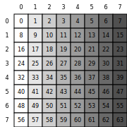
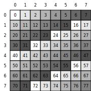
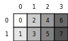

# CuTeDSL 01：`Layout` 与 `make_layout` 入门

## 前言

这个系列会系统介绍 CuTe DSL 的基本使用：从 `Layout`、`Tensor`、TV layout、layout algebra 等基础概念开始，逐步过渡到数据搬运、MMA等实现细节，最后用 CuTe DSL 完成一个高效 GEMM。

CuTe DSL 的抽象层次比较高，很多概念只看公式和代码不够直观。因此，本文会尽量配合图示说明：先把每个布局、坐标映射和线程分工画出来，再对应到代码实现。这样既能更容易理解单个 API 的行为，也能把后续 GEMM 实现中用到的基础知识串成一个完整体系。

## `Layout` 是什么

在 CUTLASS 的 CuTe 抽象里，**Layout** 描述的是「逻辑多维坐标」到「一维地址（或索引）」的映射。它把张量的形状（各维长度）与步长（沿各维前进时在地址上跳多少）绑在一起，是后续 Tensor、TMA、GEMM 分块等话题的基础。

官方 C++ 文档对概念与记号有系统说明：[CuTe — Layout](https://docs.nvidia.com/cutlass/latest/media/docs/cpp/cute/01_layout.html)。

## 用 `make_layout` 构造二维布局

Python DSL 里常用 `cute.make_layout(shape=..., stride=...)` 指定形状与步长。对二维 $(M, N)$，坐标 $(i, j)$（$i$ 为行、$j$ 为列）对应的线性索引可理解为：

$$
\text{index}(i,j) = i \cdot s_0 + j \cdot s_1

$$

其中 $(s_0, s_1)$ 即 `stride` 的两个分量。

下面示例在 `@cute.jit` 中创建布局，并用 [cute-viz](https://github.com/NTT123/cute-viz) 的 `display_layout` 在 Jupyter 里直接画出网格（格内数字为该逻辑坐标点映射到的**线性索引**）。

```python

from cutlass import cute
import cutlass
from cute_viz import display_layout


@cute.jit
def main(shape: cutlass.Constexpr = (8, 8), stride: cutlass.Constexpr = (8, 1)):
    layout = cute.make_layout(shape=shape, stride=stride)
    display_layout(layout)
```

TIPS：`cute-viz`也支持把布局写成 SVG 文件，使用 `render_layout_svg`即可。但是注意要**在 `@cute.jit`函数体内调用**，这样`layout` 仍在 MLIR 执行上下文中，`cute_viz`才能正确读取`size`、`rank` 等信息。

## 运行方式：直接调用与先编译再调用

- **直接调用**：执行 `main()`，解释器会在需要时完成编译并运行。
- **先编译再调用**：`compiled = cute.compile(main)`，之后反复调用 `compiled()` 或 `compiled(shape=..., stride=...)`，适合同一段 IR 多次执行、减少重复编译开销。

注意：本系列示例使用版本为

```
nvidia-cutlass-dsl                 4.3.1
cute-viz                           0.1.0
```

## 图示：两种步长对比

下图由 **cute-viz**（`render_layout_svg`）根据对应 `Layout` 绘制：格内为线性索引，灰阶随索引变化以便区分地址。

### 行主序、紧密存储：`stride (8, 1)`

相邻行在地址上相差 8，与 `shape` 的列长一致，因此整块 `8×8` 在内存中是**连续 64 个元素**，线性索引从左上角 `0` 到右下角 `63` 单调递增。



### 行距更大：`stride (10, 1)`

仍按行主序读 $(i, j)$，但行间步长为 $10$，相邻两行在地址上相隔 $10$ 而非 $8$，相当于在每一行末尾留出 **2 个**未用于该 `8×8` 逻辑块的「空隙」（常用于对齐、与更大矩阵子块对齐等场景）。格内数字按 $10i+j$ 计算，会出现**不连续**的线性索引与更大的地址跨度。



## 默认紧凑布局：$(2,4)$ 与「列主序」

只写 `cute.make_layout((2, 4))` 而不显式给 `stride` 时，DSL 会生成**紧凑左端主序**（compact left-most）即列主序的默认步长。对 $(2,4)$ 而言，常见打印结果为 $(2,4):(1,2)$，即

$$
\text{index}(i,j)=i+2j

$$

```python
@cute.jit
def example_default_compact_2x4():
    layout = cute.make_layout((2, 4))
    display_layout(layout)
```

同一组逻辑坐标下，行下标 $i$ 与列下标 $j$ 对地址的贡献与前面的行主序例子不同，遍历顺序表现为列主序风格的索引排列。



---

## 小结

这一篇先建立 CuTe DSL 里最基础的 `Layout` 概念：`shape` 决定合法坐标范围，`stride` 决定每个坐标分量对线性索引的贡献。

* `Layout` 本质上是从逻辑坐标到一维索引的映射。
* 同一个 `shape` 配不同 `stride`，会得到不同的内存访问模式；例如紧密行主序和带 padding 的行主序。
* 不显式指定 `stride` 时，`cute.make_layout` 默认生成紧凑左端主序，也就是列主序风格的布局。
* `cute-viz` 可以把坐标到索引的关系直接画出来，后续理解嵌套 layout、TV layout 和 GEMM 分块时都会反复用到这个视角。
