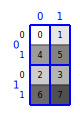
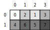
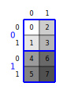
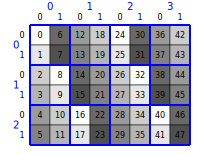
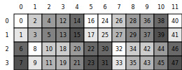

# 动手学CuTeDSL 02：分层（嵌套）`Layout`

普通二维布局把 `shape` 写成 $(M, N)$、`stride` 写成 $(s_0, s_1)$ 即可。CuTe 还允许 **`shape` 与 `stride` 在某一维上再嵌套元组**，用来表达「块 / tile / 子布局」的层次结构：外层下标选大块，内层下标在块内再细分。概念与记号仍以官方说明为准：[CuTe — Layout](https://docs.nvidia.com/cutlass/latest/media/docs/cpp/cute/01_layout.html)。

API 上仍用 `cute.make_layout(shape, stride=...)`；嵌套时，`cute.rank` 仍是**最外层维数**，`cute.size` 为元素总数，`cute.depth(layout[k])` 可查看第 $k$ 维是否还带嵌套（深度大于 0 表示该 mode 内部还有子结构）。

下文示例均需在 `@cute.jit` 内执行；先引入：

```python
from cutlass import cute
from cute_viz import display_layout, render_layout_svg
```

---

## 平面二维对比：$(2,4)$ 行主序

先固定一个**无嵌套**的 $2\times 4$ 行主序布局，便于与后面分层例子对照：

$$
\text{shape}=(2,4),\quad \text{stride}=(4,1),\quad \text{index}(i,j)=4i+j

$$

```python
@cute.jit
def example_row_major_2x4():
    layout = cute.make_layout((2, 4), stride=(4, 1))
    display_layout(layout)
```

格内数字为映射到的一维线性索引。


---

## 分层形状：$(2,(2,2))$，步长 $(4,(2,1))$

在上一节**平面** $(2,4)$ 的基础上，将第二维从「长度为 $4$ 的单层下标」改写成**嵌套的** $(2,2)$：同一维在逻辑上仍是 $2\times 2=4$ 个位置，但坐标写成 $(j,k)$ 以强调块内 $2\times 2$ 结构；第一维仍为 $i\in\{0,1\}$。配合步长 $(4,(2,1))$，块与块之间相隔 $4$，块内沿 $j$ 步长 $2$、沿 $k$ 步长 $1$，共 $8$ 个元素，索引连续铺满 $0\sim 7$：

$$
\text{shape}=(2,(2,2)),\quad \text{stride}=(4,(2,1)),\quad \text{index}(i,(j,k))=4i+2j+k

$$

关于嵌套layout有多种不同的解读方式，比如这个例子。

第一种解读方式：块下标是最左下标 $i\in\{0,1\}$， 选**上下两大行块**；每个块内再用最右下标 $(j,k)$ 表示 $2\times 2$ 子网格的块内元素下标。

第二种解读方式：块下标是最右下标 $(j,k)$ ，选 $2\times2$ 4个子块；每个块内再用最左下标 $i$ 表示块内元素。

```python
@cute.jit
def example_shape_2_2x2():
    layout = cute.make_layout((2, (2, 2)), stride=(4, (2, 1)))
    # cute.rank(layout) == 2，cute.depth(layout[1]) 为 1
  
    display_layout(layout, flatten_hierarchical=False)
    display_layout(layout, flatten_hierarchical=True)
```

注意 `cute-viz` 总是将最左下标当做块内下标，这对应了前面的第一种解读方式。

**cute-viz** 对分层布局有两种画法（均通过 `display_layout` / `render_layout_svg` 的 `flatten_hierarchical` 控制）：

- **`flatten_hierarchical=False`**：画出 **tile块 边界**（粗蓝线），外层块下标（蓝色）与块内层元素下标（黑色）用不同颜色区分，突出层次。



- **`flatten_hierarchical=True`**：压成一张平面网格。左侧行号是最左下标 $i$；顶部列号不是原始的二维坐标 $(j,k)$，而是 $(j,k)$ 被压平后的一维坐标。二维坐标和一维坐标的转换关系见下一节。



## Layout维护两种映射：坐标映射和索引映射

前面已经提到：**Layout** 描述的是「逻辑多维坐标」到「一维地址（或索引）」的映射。

但在嵌套 Layout 里，坐标本身也可能有多种写法。以上一节的布局为例：

$$
\text{shape}=(2,(2,2)),\quad \text{stride}=(4,(2,1)),\quad \text{index}(i,(j,k))=4i+2j+k

$$

Layout同时维护两类映射：

* **坐标映射**：把合法但不完全展开的坐标（例如 $n$ 或 $(i,q)$），转换成和 `shape` 对齐的自然坐标。这里的自然坐标是 $(i,(j,k))$。转换规则是反字典序，也就是 LayoutLeft 列主序：最左侧叶子下标变化最快。
* **索引映射**：把自然坐标转换成线性的 index。做法是将自然坐标和 `stride` 逐项相乘再求和；在这个例子里就是 $4i+2j+k$。

因此，`Layout` 的完整过程可以理解为：非自然坐标（例如 $n$ 或 $(i,q)$）先通过坐标映射还原为自然坐标 $(i,(j,k))$，再通过索引映射计算 $4i+2j+k$，最终得到线性 index。

第一个映射先解决「坐标怎么写」的问题。对 `shape=(2,(2,2))` 来说，1-D 坐标 $n$ 和 2-D 坐标 $(i,q)$ 都是合法写法，但它们不是最终参与 `stride` 计算的自然坐标。它们会先按 LayoutLeft 还原：


| 1-D坐标$n$ | 2-D坐标$(i,q)$ | 自然坐标$(i,(j,k))$ | index |
| ------------ | ---------------- | --------------------- | ------- |
| `0`        | `(0,0)`        | `(0,(0,0))`         | `0`   |
| `1`        | `(1,0)`        | `(1,(0,0))`         | `4`   |
| `2`        | `(0,1)`        | `(0,(1,0))`         | `2`   |
| `3`        | `(1,1)`        | `(1,(1,0))`         | `6`   |
| `4`        | `(0,2)`        | `(0,(0,1))`         | `1`   |
| `5`        | `(1,2)`        | `(1,(0,1))`         | `5`   |
| `6`        | `(0,3)`        | `(0,(1,1))`         | `3`   |
| `7`        | `(1,3)`        | `(1,(1,1))`         | `7`   |

这张表也解释了上一节 `flatten_hierarchical=True` 的可视化：

* 图被压成 $2\times4$ 的平面网格。
* 左侧行号 `0,1` 对应最左下标 $i$。
* 顶部列号 `0,1,2,3` 对应被压平的块坐标 $q$，其中 $q=j+2k$。所以列 `0,1,2,3` 依次对应 $(j,k)=(0,0),(1,0),(0,1),(1,1)$。
* 格子里的数字不是坐标，而是第二步索引映射的结果：$4i+2j+k$。所以第一行是 `0,2,1,3`，第二行是 `4,6,5,7`。

所以，`flatten_hierarchical=True` 并没有改变 Layout 的索引规则；它只是先把嵌套坐标 $(j,k)$ 按坐标映射压成一维 $q$，再把每个自然坐标对应的 index 填到平面网格里。

## 更多嵌套layout的例子

---

### 分层形状：$((2,2),2)$

Shape 为 $((2,2),2)$，逻辑坐标写作 $((i,j),k)$：第一维是嵌套的 $(2,2)$，第二维是 $k\in\{0,1\}$。默认（列主序）紧凑布局下常见打印为 $((2,2),2):((1,2),4)$。

与 $(2,(2,2))$ 不同，**嵌套写在 shape 的左侧**（第一维），而非右侧。同样可以有两种叙述角度：

其一，先按 $(i,j)$ 在 $2\times2$ 上分区，然后在每个分区内用 $k$ 排布；

其二，先按 $k$ 把整体分成两半，再在每半内用 $(i,j)$ 排布。

**cute-viz** 嵌套视图可视化仍与上一节一致：把**坐标中最左的下标**按块内层处理，并且**图中蓝字为块坐标，黑字为块内坐标**。

```python
@cute.jit
def example_shape_2x2_2():
    layout = cute.make_layout(((2, 2), 2))
  
    display_layout(layout, flatten_hierarchical=False)
    display_layout(layout, flatten_hierarchical=True)
```




---

### 更大分层块网格与非线性步长：$((2,2),(3,4))$

令

$$
\text{shape}=((2,2),(3,4)),\quad \text{stride}=((1,6),(2,12))

$$

逻辑坐标写作 $((i,j),(m,n))$：两个 mode 都是嵌套维，步长 $((1,6),(2,12))$ 。

口头描述既可以强调「先有一块 $3\times4$ 的块上网格，再在每个块里细分 $2\times2$」，也可以调换叙述顺序。

cute-viz可视化工具规则仍与前面相同：**最左下标**在可视化里按块内层处理，图中粗蓝线包围。**读图时以蓝字（块坐标）与黑字（块内坐标）为准**。

```python
@cute.jit
def example_shape_2x2_3x4():
    layout = cute.make_layout(((2, 2), (3, 4)), stride=((1, 6), (2, 12)))
  
    display_layout(layout, flatten_hierarchical=False)
    display_layout(layout, flatten_hierarchical=True)
```





---

## 小结

这一篇把普通 `Layout` 扩展到嵌套 `shape` / `stride`：嵌套不是新的机制，而是用同一套坐标到索引的规则，表达更有层次感的块结构。

* 嵌套 `shape` / `stride` 仍然用 `cute.make_layout` 构造；`rank` 看最外层维数，`size` 看元素总数，`depth` 看某个 mode 内部是否还有子结构。
* 嵌套 Layout 同时维护两类映射：先把 1-D、2-D 等非自然坐标按 LayoutLeft 规则还原为自然坐标，再用自然坐标和 `stride` 计算线性 index。
* `flatten_hierarchical=False` 保留层次边界，图中蓝字表示块坐标，黑字表示块内坐标；这适合观察 tile 的分层结构。
* `flatten_hierarchical=True` 把嵌套坐标压成平面坐标，但不会改变 Layout 的索引规则；它只是把自然坐标对应的 index 填到一个更容易对照的平面网格里。
* 同一个嵌套布局可以有多种叙述角度。读图时以坐标映射和索引映射为准，不必把 cute-viz 的展示顺序当成唯一解释。
