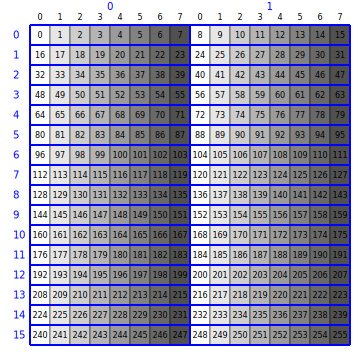
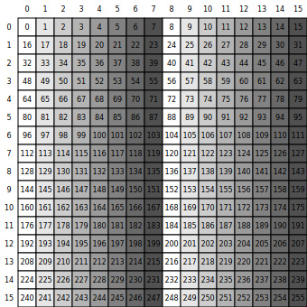
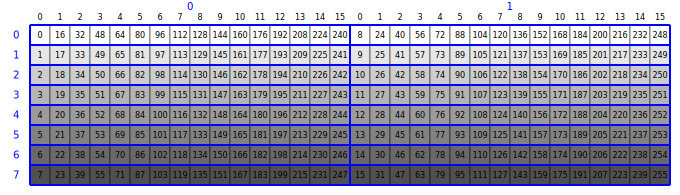
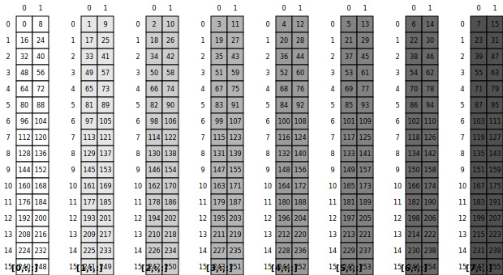

# 动手学CuTeDSL 04：layout 代数中的除法操作

CuTe 的 layout algebra 中除法操作关注的是：给定一个原始 `Layout`（或带 layout 的 `Tensor`）以及一个 `tiler`，如何把原来的逻辑坐标重新组织成“tile 内”与“tile 外”两层结构。官方概念说明见 [CuTe Layout Algebra](https://docs.nvidia.com/cutlass/latest/media/docs/cpp/cute/02_layout_algebra.html)，这里用几个最小示例把三种常见操作串起来看。

本文用到的可视化函数与 notebook 一致：

```python
import cutlass
from cutlass import cute
from cute_viz import display_layout
```

## zipped_divide

`zipped_divide` 是最适合作为入口的 divide 操作。它会把所有 tile 内坐标打包到一起，再把所有 tile 外坐标打包到一起，这对`cute-viz`可视化很友好。对二维情形，可记为：

$$
(\text{M}, \text{N}) \xrightarrow{\text{zipped\_divide by }(\text{TileM}, \text{TileN})}
((\text{TileM}, \text{TileN}), (\text{RestM}, \text{RestN}))

$$

这很适合表达“先选 tile 内位置，再选第几个 tile”。

```python
import torch
from cutlass.cute.runtime import from_dlpack

M, N = 16, 16

A = torch.arange(M * N, device="cpu", dtype=torch.float16).reshape(M, N)
mA = from_dlpack(A, assumed_align=16)

@cute.jit
def zipped_divide_example(mA: cute.Tensor):
    layout = mA
    tiler = (
        cute.make_layout(1, stride=1),
        cute.make_layout(8, stride=1),
    )

    result = cute.zipped_divide(layout, tiler=tiler)

    print(">>> Layout:", layout)
    display_layout(layout.layout, flatten_hierarchical=False)
    print(">>> Tiler :", tiler)
    print(">>> Zipped Divide Result:", result)
    display_layout(result.layout, flatten_hierarchical=False)
    cute.print_tensor(mA)
    cute.print_tensor(result, verbose=True)

    tidx = 1
    cur_tile = result[(None, tidx)]
    cute.print_tensor(cur_tile)


zipped_divide_example(mA)
```

这个例子里，输入 tensor 的 layout 是：

$$
(16,16):(16,1)

$$

`zipped_divide` 后得到：

$$
((1,8),(16,2)):((0,1),(16,8))

$$

这表示 tile 内坐标被统一并到第一组 `((1,8))`，而 tile 网格坐标被放到第二组 `((16,2))`。由于输入张量内容是按 `0,1,2,\dots,255` 顺序填充的，取 `result[(None, 1)]` 时，得到的正是第 2 个列块，也就是每行的第 `8..15` 列。

zipped_divide input layout:


zipped_divide result layout:



## logical_divide

有了 `zipped_divide` 作为参照，再看 `logical_divide` 会更容易理解：它同样按 `tiler` 对原 layout 做逻辑分块，但不会把所有 tile 内坐标统一打包，而是在结果中保留“每个原始 mode 被分块后的层次结构”。对二维例子，常见的结果形状可以记成：

$$
(\text{M}, \text{N}) \xrightarrow{\text{logical\_divide by }(\text{TileM}, \text{TileN})}
((\text{TileM}, \text{RestM}), (\text{TileN}, \text{RestN}))

$$

也就是说，每个原始 mode 都会各自拆成“tile 内坐标”和“tile 外块编号”两层。

下面把一个 $16 \times 16$ 的行主序矩阵，沿列方向按 8 个元素一组做逻辑分块：

```python
M, N = 16, 16

@cute.jit
def logical_divide_2d_example():
    layout = cute.make_layout((M, N), stride=(N, 1))
    tiler = (
        cute.make_layout(1, stride=1),
        cute.make_layout(8, stride=1),
    )

    result = cute.logical_divide(layout, tiler=tiler)

    print(">>> Layout:", layout)
    display_layout(layout, flatten_hierarchical=True)
    print(">>> Tiler :", tiler)
    print(">>> Logical Divide Result:", result)
    display_layout(result, flatten_hierarchical=False)
    cute.printf(">?? Logical Divide Result: {}", result)


logical_divide_2d_example()
```

原布局是：

$$
(16,16):(16,1)

$$

分块结果是：

$$
((1,16),(8,2)):((0,16),(1,8))

$$

这里第一维的 tile 大小是 1，所以行方向实际上没有被切分；第二维按 8 列分块，因此列方向被拆成“块内 8 列”和“共 2 个块”两层。

2D logical_divide input layout:



2D logical_divide result layout: 由于 `cute-viz` 将最左边坐标 `(1,16)`解读为块内坐标，将 `(8,2)`解读为块坐标，所以不能得到 `(1,8)`为Tile的理想可视化结果。



## tiled_divide

`tiled_divide` 把 tile 本身放在结果最前面，但不会像 `zipped_divide` 那样把所有 tile 外坐标再打包成一组，而是让剩余坐标继续平铺在后面。二维情形可以记成：

$$
(\text{M}, \text{N}) \xrightarrow{\text{tiled\_divide by }(\text{TileM}, \text{TileN})}
((\text{TileM}, \text{TileN}), \text{RestM}, \text{RestN})

$$

在打印结果时，CuTe 常把前两个 tile mode 组合显示成一组。

```python
M, N = 16, 16

@cute.jit
def tiled_divide_example():
    layout = cute.make_layout((M, N), stride=(N, 1))
    tiler = (
        cute.make_layout(1, stride=1),
        cute.make_layout(8, stride=1),
    )

    result = cute.tiled_divide(layout, tiler=tiler)

    print(">>> Layout:", layout)
    display_layout(layout, flatten_hierarchical=False)
    print(">>> Tiler :", tiler)
    print(">>> Tiled Divide Result:", result)
    display_layout(result, flatten_hierarchical=False)
    cute.printf(">?? Tiled Divide Result: {}", result)


tiled_divide_example()
```

输出结果为：

$$
((1,8),16,2):((0,1),16,8)

$$

和 `zipped_divide` 相比，这里 tile 内形状仍然是 `(1,8)`，但外层的两个剩余坐标 `16` 与 `2` 不再额外打包成一个 mode，而是直接顺次排在后面。

tiled_divide input layout:


tiled_divide result layout: 由于`display_layout`只能图示2维的内容。当layout维度超过2维时，只图示最后2维的内容，前面其余的维度会遍历依次排开。所以也不能理想地展示tile情况。



---

## 小结

- `zipped_divide`：把所有 tile 内坐标打包到一起，把所有 tile 外坐标打包到一起。
- `logical_divide`：每个原始 mode 分别拆成“tile 内 + tile 外”两层。
- `tiled_divide`：把 tile 本身提到最前面，剩余坐标继续作为后续 mode 展开。

三者并不改变底层数据，只是在重写同一块数据的逻辑坐标组织方式。理解它们的最好方法，是先用 `zipped_divide` 建立“tile 内 + tile 外”的直观图像，再对比 `logical_divide` 和 `tiled_divide` 如何调整这两类坐标的嵌套方式。
