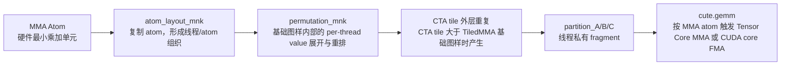

# 动手学 CuTeDSL 05：MMA Atom、`TiledMMA`、`atom_layout_mnk` 与 `permutation_mnk`

CuTe 里和 GEMM 计算最相关的一组对象，是 **MMA Atom** 与它向上组成的 **`TiledMMA`**。这里的 MMA 不只指 Tensor Core 指令，也可以表示 CUDA core 上的标量 FMA。CuTe 文档把 MMA Atom 放在多个硬件层级上理解：


| 层级          | 典型硬件/计算能力                     | 典型指令或 CuTe 接口                              | 直观含义                                                 |
| --------------- | --------------------------------------- | --------------------------------------------------- | ---------------------------------------------------------- |
| single thread | CUDA core                             | PTX`fma.f32`，CuTe `MmaUniversalOp(Float32)`      | 一个线程独立做标量乘加                                   |
| quadpair      | Volta V100，SM70 / CC 7.0             | Volta Tensor Core HMMA 的 quadpair 建模           | warp 内少量线程协作完成一个 atom                         |
| warp          | Ampere A100，SM80 / CC 8.0            | PTX`mma.sync`，CuTe `MmaF16BF16Op(..., (16,8,8))` | 一个 warp 的 32 个线程共同完成一个矩阵乘累加             |
| warpgroup     | Hopper H100，SM90 / CC 9.0            | PTX`wgmma.mma_async`                              | 多个 warp 组成 warpgroup，共同驱动更大的 Tensor Core MMA |
| tcgen05       | Blackwell GB200/B200，SM100 / CC 10.0 | PTX TensorCore 5th Generation family instructions | 第五代 Tensor Core 的异步 MMA 执行模型                   |

这些层级的编程接口和同步模型不同，但在 CuTe 里都可以放进“某个硬件层级上的 MMA Atom，再向上组合成 `TiledMMA`”这条主线里理解。

本文重点介绍两类最容易建立编程模型的情况，并且先讲 Tensor Core，再讲 CUDA core：

- **warp-level Tensor Core MMA**：它更接近通用的 MMA Atom 抽象，一个 atom 对应一条矩阵乘累加指令，一个 warp 按固定 fragment 规则协作执行；
- **CUDA core MMA**：它是大小接近 `1x1x1` 的 single-thread MMA 特例，每个线程用 FP32 FMA 完成自己负责的累加。

贯穿这两类实现的核心对象是：

- **MMA Atom** 对应某个硬件层级上的最小乘加计算单元，以及它要求的线程/寄存器分工；
- **`TiledMMA`** 则是在这个 atom 之上，继续沿 $M/N/K$ 方向做复制、重排与扩展，得到一个更大的逻辑计算单元。

前半部分先围绕 `SM80` 上常见的 `16x8x8` warp-level MMA 例子，说明：

1. `display_tiled_mma` 展示的到底是什么；
2. `thread_mma.get_slice()` 如何把一个 tile 切成线程级任务；
3. `atom_layout_mnk` 如何在 $M/N/K$ 三个方向复制 MMA atom；
4. `permutation_mnk` 如何在不改变单次 MMA 语义的前提下，重排更大 tile 内的逻辑坐标。

最后再回到 CUDA core SGEMM，说明同一套 `TiledMMA` 抽象如何落到每个线程自己的 FP32 FMA 上。

参考资料：

- [CuTe MMA atoms](https://docs.nvidia.com/cutlass/latest/media/docs/cpp/cute/0t_mma_atom.html)
- [PTX warp-level matrix instructions](https://docs.nvidia.com/cuda/parallel-thread-execution/#warp-level-matrix-instructions-for-mma)
- [PTX warpgroup-level matrix instructions](https://docs.nvidia.com/cuda/parallel-thread-execution/#asynchronous-warpgroup-level-matrix-multiply-accumulate-instructions)
- [PTX TensorCore 5th Generation family instructions](https://docs.nvidia.com/cuda/parallel-thread-execution/#tensorcore-5th-generation-family-instructions)
- [PTX floating point fma instruction](https://docs.nvidia.com/cuda/parallel-thread-execution/#floating-point-instructions-fma)
- [CUTLASS Efficient GEMM in CUDA](https://docs.nvidia.com/cutlass/latest/media/docs/cpp/efficient_gemm.html)
- [cute-viz MMA example](https://github.com/NTT123/cute-viz/blob/main/examples/mma_atom_example.py)

本文示例默认使用：

```python
import cutlass
from cutlass import cute, Float16, Float32
from cute_viz import display_tiled_mma, display_tv_layout

from cutlass.cute.runtime import from_dlpack
import torch
```

---

## 从一个 `16x8x8` MMA Atom 开始

先看最基本的 warp-level MMA：输入矩阵 $A$ 的形状是 $(M,K)$，输入矩阵 $B$ 的形状是 $(N,K)$，输出/累加矩阵 $C$ 的形状是 $(M,N)$。对于 `SM80` 上的 `F16/BF16 -> F32` MMA atom，一个常见形状是：

$$
(M,N,K) = (16,8,8)

$$

也就是说，一次 atom 逻辑上完成一个 $16 \times 8$ 输出块的累加，归约维度长度为 $8$。

```python
@cute.jit
def mma_atom_demo():
    tile_mnk = (16, 8, 8)
    m, n, k = tile_mnk

    mma_atom = cute.nvgpu.warp.MmaF16BF16Op(Float16, Float32, tile_mnk)
    tiled_mma = cute.make_tiled_mma(mma_atom)

    print(f"tile_mnk = {tile_mnk}")
    print(f"tiled_mma = {tiled_mma}")

    display_tiled_mma(tiled_mma, tile_mnk)

    print("A TV layout:")
    display_tv_layout(tiled_mma.tv_layout_A, (m, k))
    print("B TV layout:")
    display_tv_layout(tiled_mma.tv_layout_B, (n, k))
    print("C TV layout:")
    display_tv_layout(tiled_mma.tv_layout_C, (m, n))
```

这里 `cute.make_tiled_mma(mma_atom)` 没有额外指定 `atom_layout_mnk` 或 `permutation_mnk`，所以 `TiledMMA` 只包含一个原始 MMA atom，逻辑 tile 尺寸仍然是 `16x8x8`。后面几节会再看如何通过 `atom_layout_mnk` 和 `permutation_mnk` 把这个基础 atom 扩成更大的计算图样。

这里有一个非常实用的理解方式：

- `display_tiled_mma(tiled_mma, tile_mnk)` 展示的是整个 MMA 的输入输出分工图；
- `tiled_mma.tv_layout_A`、`tv_layout_B`、`tv_layout_C` 则分别给出 A/B/C 三个矩阵各自的 **thread-value layout**。

因此，可以把 `display_tiled_mma` 看成是把三张 TV layout 图放到同一个 MMA 语义框架里一起看：

- 左边是 A 的 $(M,K)$ 分工；
- 上边是 B 的 $(N,K)$ 分工；
- 右下是 C 的 $(M,N)$ 分工。

对于这个 `16x8x8` atom，warp 中 32 个线程并不是“每个线程负责一整行或一整列”，而是每个线程持有若干寄存器槽位。可视化图里常见的 `T0` 到 `T31` 表示线程编号，`V0`、`V1`、`V2`、`V3` 表示该线程内部不同的 value/register 槽位。这是硬件上 warp-level MMA 的要求，可以看官方文档中 [Matrix Fragments for mma.m16n8k8](https://docs.nvidia.com/cuda/parallel-thread-execution/#warp-level-matrix-fragment-mma-1688) 一节的图示说明来和下图对应。

这张基础 `16x8x8` MMA atom 图把 A、B、C 三部分的 thread-value 分工放在同一个视图里展示。


---

## 把 tile 切成线程级工作

`TiledMMA` 在实际使用时，通常不是直接“整体访问 A/B/C”，而是先取出某个线程对应的切片，再让这个线程只访问自己负责的那部分 fragment。

下面用 A 矩阵演示这个过程。为了让线程切片更明显，这里构造一个比单次 MMA 更大的 A tile：

$$
A \in \mathbb{R}^{(16 \cdot 2) \times (8 \cdot 3)} = \mathbb{R}^{32 \times 24}

$$

```python
tile_mnk = (16, 8, 8)
m, n, k = tile_mnk
mma_m = 2
mma_k = 3

@cute.jit
def thread_mma_demo(A: cute.Tensor):
    mma_atom = cute.nvgpu.warp.MmaF16BF16Op(Float16, Float32, tile_mnk)
    tiled_mma = cute.make_tiled_mma(mma_atom)

    thread_idx = 0
    thread_mma = tiled_mma.get_slice(thread_idx)

    cute.printf("A = ")
    cute.print_tensor(A)

    # (BLK_M, BLK_K) -> (MMA, MMA_M, MMA_K)
    tAgA = thread_mma.partition_A(A)
    print(f"tAgA: {tAgA}")

    cute.printf("tAgA[None, 0, 0] = ")
    cute.print_tensor(tAgA[None, 0, 0])

    cute.printf("tAgA = ")
    cute.print_tensor(tAgA)


A = torch.arange(m * mma_m * k * mma_k).reshape(m * mma_m, k * mma_k)
thread_mma_demo(from_dlpack(A))
```

这段代码里最关键的是：

```python
thread_mma = tiled_mma.get_slice(thread_idx)
tAgA = thread_mma.partition_A(A)
```

`partition_A` 的结果可理解为把原始的 $(\text{BLK\_M}, \text{BLK\_K})$ tile，改写成：

$$
(\text{MMA}, \text{MMA\_M}, \text{MMA\_K})

$$

其中：

- `MMA` 表示单个线程在“一次 MMA atom”内持有的寄存器片段；
- `MMA_M` 表示这个更大 tile 在 $M$ 方向上需要分几块；
- `MMA_K` 表示这个更大 tile 在 $K$ 方向上需要分几块。

也就是说，`thread_mma` 的职责就是把“一个大 tile 的线程工作”拆成“这个线程需要参与哪些 MMA、小块内拿哪些元素”。这个操作就是前面提到的layout除法的封装，具体来说就是 `tiled_divide`。

还有一点需要提醒，上面这段代码是用 `@cute.jit`装饰，而不是用 `@cute.kernel`，所以它运行在CPU上，而不是GPU上。这里跟实际使用的情况不同，它只是在CPU上用 `thread_idx=0`来对Tensor进行`cute`运算，展示Tensor的变换。

把同一个例子扩展到 A/B/C 三个张量，可以得到下面的形状关系。这里使用设置：

```text
MMA atom = 16x8x8
A = (32,32)
B = (24,32)
C = (32,24)
```

实际partition 结果为：


| partition        | 输入形状                   | 输出形状      | 抽象含义              |
| ------------------ | ---------------------------- | --------------- | ----------------------- |
| `partition_A(A)` | `(BLK_M, BLK_K) = (32,32)` | `((2,2),2,4)` | `(MMA, MMA_M, MMA_K)` |
| `partition_B(B)` | `(BLK_N, BLK_K) = (24,32)` | `(2,3,4)`     | `(MMA, MMA_N, MMA_K)` |
| `partition_C(C)` | `(BLK_M, BLK_N) = (32,24)` | `((2,2),2,3)` | `(MMA, MMA_M, MMA_N)` |

这里的 `MMA` 维度来自单次 `16x8x8` warp-level MMA atom 内部的线程 fragment：A/C 中当前线程持有 `((2,2))`，B 中当前线程持有 `2`。外层的 `2/3/4` 才是大 tile 相对单次 atom 在 $M/N/K$ 方向上的重复次数。

---

## `atom_layout_mnk`：沿 $M/N/K$ 复制 MMA atom

单个 MMA atom 只覆盖固定大小的 $(16,8,8)$。如果希望一个更大的逻辑 tile 由多个 atom 共同组成，可以通过 `atom_layout_mnk` 指定在 $M/N/K$ 三个方向各复制多少次。

例如下面这个例子，把 atom 在 $M$ 和 $N$ 上各复制 2 次：

$$
\text{atom\_layout\_mnk}=(2,2,1)

$$

于是总 tile 变成：

$$
(M,N,K) = (16 \cdot 2,\ 8 \cdot 2,\ 8 \cdot 1) = (32,16,8)

$$

```python
mma_mnk = (16, 8, 8)
mma_m, mma_n, mma_k = mma_mnk
atom_m = 2
atom_n = 2
atom_k = 1

m = mma_m * atom_m
n = mma_n * atom_n
k = mma_k * atom_k
tile_mnk = (m, n, k)

@cute.jit
def atom_layout_demo():
    mma_atom = cute.nvgpu.warp.MmaF16BF16Op(Float16, Float32, mma_mnk)
    tiled_mma = cute.make_tiled_mma(
        mma_atom,
        atom_layout_mnk=(atom_m, atom_n, atom_k),
    )

    display_tiled_mma(tiled_mma, tile_mnk)
```

直观上可以把它理解为：原来只有一个 `16x8x8` 的 MMA atom，现在变成了一个由多个 atom 拼出来的更大逻辑 MMA。

这张 `atom_layout_mnk=(2,2,1)` 图展示了 4 个 MMA atom 如何拼成一个更大的 `32x16x8` 逻辑 MMA。


从 `partition_A/B/C` 看，这个例子可以用正好等于 `TiledMMA` 基础尺寸的 tile 来观察：

```text
tiled_mma tile_mnk = (32,16,8)
A = (32,8)
B = (16,8)
C = (32,16)
```

某个 thread 的实际 partition 结果为：


| partition        | 输入形状                   | 输出形状      | 抽象含义              |
| ------------------ | ---------------------------- | --------------- | ----------------------- |
| `partition_A(A)` | `(BLK_M, BLK_K) = (32,8)`  | `((2,2),1,1)` | `(MMA, MMA_M, MMA_K)` |
| `partition_B(B)` | `(BLK_N, BLK_K) = (16,8)`  | `(2,1,1)`     | `(MMA, MMA_N, MMA_K)` |
| `partition_C(C)` | `(BLK_M, BLK_N) = (32,16)` | `((2,2),1,1)` | `(MMA, MMA_M, MMA_N)` |

这里的 `1` 很关键：它不表示 `atom_layout_mnk=(2,2,1)` 没有扩展，而是表示对固定的 `get_slice(thread_idx)` 来说，这个线程只看到自己所属的那个 atom fragment。`atom_layout_mnk` 的扩展发生在 `TiledMMA` 的线程布局上，可以理解为把多个 `16x8x8` atom 放到不同的 $M/N$ atom 坐标；更多输出区域由其他 thread slice 覆盖，而不是让同一个线程在 `partition_C` 里多出外层 `MMA_M/MMA_N` 循环。

### 为什么通常不建议把 `atom_k` 设置大于1？

如果把 `atom_k` 也扩成 2，例如：

$$
\text{atom\_layout\_mnk}=(2,2,2)

$$

那么多个 atom 会在同一个输出 C tile 上，沿着同一组 $(M,N)$ 坐标同时做不同 K 分块的累加。逻辑上这当然仍然是在做 GEMM 的 K 维归约，但它也意味着：

- 多个并行 MMA 会共同更新同一片 C 结果；
- 需要更仔细地安排寄存器累加与后续同步；
- 设计上通常不如只在 $M/N$ 上扩展那样直接。

因此，实际模板里更常见的是：

- 在 $M$ 上扩 atom；
- 在 $N$ 上扩 atom；
- `atom_k = 1` 保持不变，让atom迭代多次来完成$K$维度上累加 ~~，这个迭代是通过后面的`permutation_mnk`来实现的~~

下面这个例子能直观看到 $K$ 方向也扩张后的逻辑形状：

```python
mma_mnk = (16, 8, 8)
atom_m = 2
atom_n = 2
atom_k = 2

tile_mnk = (
    mma_mnk[0] * atom_m,
    mma_mnk[1] * atom_n,
    mma_mnk[2] * atom_k,
)

@cute.jit
def atom_layout_k_demo():
    mma_atom = cute.nvgpu.warp.MmaF16BF16Op(Float16, Float32, mma_mnk)
    tiled_mma = cute.make_tiled_mma(
        mma_atom,
        atom_layout_mnk=(atom_m, atom_n, atom_k),
    )

    display_tiled_mma(tiled_mma, tile_mnk)
```

这张 `atom_layout_mnk=(2,2,2)` 图把沿 K 方向继续扩展之后的 MMA 组织方式直观画了出来，可以看到 A 矩阵和 B 矩阵在 K 方向上有了两倍的线程参与（也就是会使用 2倍的mma计算单元）。但是实际很少这样使用。


---

## `permutation_mnk`：重排更大 tile 的逻辑坐标

仅靠 `atom_layout_mnk`，我们得到的是“把多个 atom 直接并排摆起来”的大 tile。但有时这还不够，因为我们还希望：

- 不增加线程数，而是通过增加每个线程处理的元素个数来扩展更大的tile；
- 同一线程在寄存器里的 value 排列更规整；
- 某个维度上的访问尽量连续；
- 更方便和 shared memory / global memory 的布局配合。

这时就会用到 `permutation_mnk`。

一个非常有用的理解是：`permutation_mnk` 可以看成分别作用在 $M/N/K$ 三个 mode 上的 **tiler/layout**。它先重排这些逻辑坐标，再把 TV layout 映射应用上去。

最简单的情况，是把 `permutation_mnk` 直接写成 tile 本身：

```python
mma_mnk = (16, 8, 8)
tile_mnk = (16, 16, 8)

@cute.jit
def mma_permutation_identity_demo():
    mma_atom = cute.nvgpu.warp.MmaF16BF16Op(Float16, Float32, mma_mnk)

    tiled_mma = cute.make_tiled_mma(
        mma_atom,
        atom_layout_mnk=(1, 1, 1),
        permutation_mnk=tile_mnk,
    )

    display_tiled_mma(tiled_mma, tile_mnk)
```

当 $N$ 从 8 扩成 16 时，线程数不会像前面 `atom_layout_mnk` 的例子中变多，而是每个线程会持有更多 value，但如果只做“直接扩展”，这些 value 在逻辑坐标上通常只是简单重复原来的 pattern，不一定连续，也不一定是最适合后续访存的顺序。

这张直接扩展到 `16x16x8` 的图说明：虽然整体 tile 变大了，但每个线程拿到的 value 仍然保持未经 permutation 的原始排布方式。


对应的 partition 形状如下。这里被 partition 的 tile 正好等于 permutation 后的基础尺寸：

```text
tiled_mma tile_mnk = (16,16,8)
A = (16,8)
B = (16,8)
C = (16,16)
```

某个 thread 的实际 partition 结果为：


| partition        | 输入形状                   | 输出形状      | 抽象含义              |
| ------------------ | ---------------------------- | --------------- | ----------------------- |
| `partition_A(A)` | `(BLK_M, BLK_K) = (16,8)`  | `((2,2),1,1)` | `(MMA, MMA_M, MMA_K)` |
| `partition_B(B)` | `(BLK_N, BLK_K) = (16,8)`  | `(2,2,1)`     | `(MMA, MMA_N, MMA_K)` |
| `partition_C(C)` | `(BLK_M, BLK_N) = (16,16)` | `((2,2),1,2)` | `(MMA, MMA_M, MMA_N)` |

和前面的 `atom_layout_mnk` 不同，这里的 `MMA_N = 2` 出现在当前 thread 自己的 fragment 里。原因是 `permutation_mnk` 没有增加参与线程数，而是把 $N$ 从 `8` 扩到 `16` 后，让同一批线程在 $N$ 方向持有更多 value。也就是说，`permutation_mnk` 更像是在 `TiledMMA` 内部增加每个线程的 value 展开，而不是增加新的 warp-level atom。

---

## 在 $N$ 方向做规则化重排

`permutation_mnk` 更典型的用途，是只对某一个 mode 做自定义重排。例如下面只重排 $N$ mode：

```python
mma_mnk = (16, 8, 8)
m, n, k = 16, 16, 8

@cute.jit
def mma_permutation_n_demo():
    mma_atom = cute.nvgpu.warp.MmaF16BF16Op(Float16, Float32, mma_mnk)

    tiled_mma = cute.make_tiled_mma(
        mma_atom,
        atom_layout_mnk=(1, 1, 1),
        permutation_mnk=(
            m,
            cute.make_layout((2, 4, 2), stride=(1, 4, 2)),
            k,
        ),
    )

    display_tiled_mma(tiled_mma, (m, n, k))
```

这个 `cute.make_layout((2,4,2), stride=(1,4,2))` 只作用在 $N$ 维上。它不是改变单次 `16x8x8` MMA atom 的内部寄存器规则，而是把“多次 MMA 组合起来之后”的逻辑 $N$ 坐标重新排列。

这样做的结果通常是：

- 相同线程在 $N$ 方向负责的元素更连续；
- B/C 的逻辑布局更容易和共享内存或寄存器布局对齐；
- 多次 MMA 的结果在更大的 tile 中呈现“交错但规整”的排布。

这也是很多 GEMM kernel 里需要的效果，因为访存连续性和寄存器布局是否顺手，都会直接影响后续 copy / store 的设计。

这张 N 方向 scatter permutation 图展示了两个 `16x8x8` MMA 子块如何在 N 维上交错重排，从而让每个线程看到更规整的布局。


如果把前面的直接扩展换成这里的 N 方向 scatter，`partition_A/B/C` 的输出形状仍然是同一张表：A 不受 $N$ 重排影响，B/C 仍然各自多出一个 `MMA_N = 2`。真正变化的是 $N$ 方向的 layout stride，也就是这两个 value 在逻辑 tile 里的摆放方式。

---

## `atom_layout_mnk` 与 `permutation_mnk` 组合使用

真实 kernel 里，常常会先用 `atom_layout_mnk` 扩大参与计算的线程数，再用 `permutation_mnk` 调整输出 tile 内部的逻辑排布，以及让每个线程处理更多的数据。

例如先用 `atom_layout_mnk` 在 $M/N$ 上各扩 2 倍：

$$
(16,8,8) \rightarrow (32,16,8)

$$

然后再用 `permutation_mnk` 把数据逻辑上扩到更大的 $N$ 维 tile：

$$
(32,16,8) \rightarrow (32,32,8)

$$

```python
mma_mnk = (16, 8, 8)
atom_m = 2
atom_n = 2
atom_k = 1

m = 16 * atom_m
n = 8 * atom_n * 2
k = 8 * atom_k

@cute.jit
def mma_atom_and_permutation_demo():
    mma_atom = cute.nvgpu.warp.MmaF16BF16Op(Float16, Float32, mma_mnk)

    tiled_mma = cute.make_tiled_mma(
        mma_atom,
        atom_layout_mnk=(atom_m, atom_n, atom_k),
        permutation_mnk=(
            m,
            cute.make_layout((2, 4, 4), stride=(1, 8, 2)),
            k,
        ),
    )

    print(f"tiled_mma = {tiled_mma}")
    display_tiled_mma(tiled_mma, (m, n, k))
```

这个模式的价值在于：

- `atom_layout_mnk` 负责“需要多少个 MMA atom 一起工作”；
- `permutation_mnk` 负责“这些 atom 的结果在更大 tile 中怎么排更合适”。

两者职责不同，但配合起来正好构成了从“硬件原子指令”到“工程上可用的大 tile MMA”之间的桥梁。

这张 `atom_layout_mnk` 与 permutation 组合图展示了一个更大的 `32x32x8` MMA tile 如何同时完成线程扩展和逻辑重排。


---

## 组合 `TiledMMA` 的 `partition_A/B/C`

上面的组合示例中，`TiledMMA` 的基础计算图样是：

```text
tiled_mma tile_mnk = (32,32,8)
```

为了看清楚外层重复维度，使用了比基础图样在 $M/N/K$ 上都大一倍的 tile：

```text
A = (64,16)
B = (64,16)
C = (64,64)
```

实际某个 thread 的 partition 结果为：


| partition        | 输入形状                   | 输出形状          | 抽象含义              |
| ------------------ | ---------------------------- | ------------------- | ----------------------- |
| `partition_A(A)` | `(BLK_M, BLK_K) = (64,16)` | `((2,2),2,2)`     | `(MMA, MMA_M, MMA_K)` |
| `partition_B(B)` | `(BLK_N, BLK_K) = (64,16)` | `(2,(2,2),2)`     | `(MMA, MMA_N, MMA_K)` |
| `partition_C(C)` | `(BLK_M, BLK_N) = (64,64)` | `((2,2),2,(2,2))` | `(MMA, MMA_M, MMA_N)` |

这张表要和前面几节的 partition 表连起来读。

首先，最左侧的 `MMA` 仍然来自单次 `16x8x8` warp-level atom 的线程私有 fragment：A/C 是 `((2,2))`，B 是 `2`。组合 `atom_layout_mnk` 与 `permutation_mnk` 不会改变单个 atom 内部的 fragment 形状。

其次，`atom_layout_mnk=(2,2,1)` 的含义仍然和前面 `atom_layout_mnk` 表格一致：它把多个 atom 放到更大的线程/atom 网格里。对固定的 `get_slice(thread_idx)` 来说，`atom_layout_m` / `atom_layout_n` 不会直接变成当前线程的 `MMA_M` / `MMA_N` 外层循环；当前线程只属于其中一个 atom 坐标。因此，A/C 里的 `MMA_M = 2` 不是来自 `atom_layout_m = 2`，而是来自被 partition 的输入 tile 比最终 `TiledMMA` 基础图样还大一倍：

$$
64 / 32 = 2

$$

最后看 $N$ 方向。前面的 `permutation_mnk` 表格已经看到：不增加线程数而把 $N$ 从 `8` 扩到 `16` 时，B/C 的 `MMA_N` 会出现一个 `2`，表示同一个 thread 在 $N$ 方向多持有一组 value。组合示例里也是这个逻辑，只是又叠加了一层 CTA tile 相对最终 `TiledMMA` 的外层重复，所以 `MMA_N` 写成嵌套的 `(2,2)`：

```text
MMA_N = (2, 2)
         |  |
         |  +-- 外层 CTA 重复：输入 N = 64，相对 TiledMMA N = 32 再重复 2 次
         +----- TiledMMA 内部 permutation 展开：在一个 32-wide TiledMMA 内，
                同一 thread 沿 N 方向持有 2 组 value
```

注意，前一个 `2` 不是 `atom_layout_n = 2`。`atom_layout_n = 2` 已经体现在 `TiledMMA` 的线程/atom 坐标中，用来把中间图样扩到 `32x16x8`；这里 `MMA_N` 前一个 `2` 来自后续 `permutation_mnk` 把 $N$ 方向继续组织到 `32`。同理，A/B 输出最后的 `MMA_K = 2` 来自输入 $K=16$ 相对 `TiledMMA` 基础 $K=8$ 的外层重复。

所以可以把两个最容易混淆的输出形状读成：

- `partition_B(B) -> (2,(2,2),2)`：`2` 是单个 atom 的 B fragment，`(2,2)` 是“permutation 内部 N 展开 × CTA 外层 N 重复”，最后的 `2` 是外层 K 重复；
- `partition_C(C) -> ((2,2),2,(2,2))`：`((2,2))` 是单个 atom 的 C fragment，中间的 `2` 是外层 M 重复，最后的 `(2,2)` 同样是“permutation 内部 N 展开 × CTA 外层 N 重复”。

---

## 用 `cute.gemm` 触发 warp-level MMA

前面几节只是在解释 `TiledMMA` 如何描述线程、value 和 tile 的几何关系。真正触发矩阵乘法运算时，kernel 会先把 shared memory / global memory 上的 tile 分成线程私有 fragment，再把这些 fragment 交给 `cute.gemm`：

```python
thr_mma = tiled_mma.get_slice(tidx)

tCsA = thr_mma.partition_A(sA)
tCsB = thr_mma.partition_B(sB)
tCgC = thr_mma.partition_C(gC)

tCrA = tiled_mma.make_fragment_A(tCsA[None, None, None, 0])
tCrB = tiled_mma.make_fragment_B(tCsB[None, None, None, 0])
tCrC = tiled_mma.make_fragment_C(tCgC)
tCrC.fill(0.0)
```

这里的 `partition_A/B/C` 负责建立“当前线程应该访问哪些元素”的视图，`make_fragment_A/B/C` 则按照 `tiled_mma` 的 TV layout 创建寄存器 fragment。对 warp-level Tensor Core MMA 来说，A/B 的寄存器布局必须匹配底层 `mma.sync` 要求的 fragment 格式，因此通常还会用和 `tiled_mma` 匹配的 shared-memory-to-register copy，把 shared memory 中的数据搬进 `tCrA` / `tCrB`。

主循环里，真正的计算入口是：

```python
for k_block in cutlass.range(num_k_block, unroll_full=True):
    cute.gemm(
        tiled_mma,
        tCrC,
        tCrA[None, None, k_block],
        tCrB[None, None, k_block],
        tCrC,
    )
```

这条 `cute.gemm` 的含义是：按照 `tiled_mma` 描述的 warp-level MMA atom、`atom_layout_mnk` 和 `permutation_mnk`，把当前 `k_block` 的 A/B 寄存器 fragment 做矩阵乘累加，并累加到 C fragment。对 `MmaF16BF16Op(Float16, Float32, (16,8,8))` 这样的 atom，底层会走 warp 协作的 Tensor Core MMA；外层 `k_block` 循环则对应前面 partition 表里的 `MMA_K` 维度。

因此，`TiledMMA` 的职责可以分成两步看：

1. `partition_A/B/C` 和 `make_fragment_A/B/C` 决定每个线程拿到什么寄存器 fragment；
2. `cute.gemm` 根据同一个 `tiled_mma` 解释这些 fragment，并实际发起 warp-level MMA 累加。

后面 CUDA core 的例子仍然会调用 `cute.gemm`，但底层 atom 会换成 single-thread FMA；也就是说，接口形状相同，真正发出的计算指令由 `tiled_mma` 中的 MMA atom 决定。

---

## CUDA Core MMA：用 FMA 组织 SIMT GEMM

前面几节讲的是 Tensor Core 路线：一个 MMA atom 对应类似 `mma.sync` 这样的 warp-level 指令，32 个线程共同完成一个固定形状的矩阵乘累加。

在Tensor Core硬件之前，是用CUDA core 来完成GEMM的。它的编程模型明显不同：底层不是 warp 协作的一条矩阵指令，而是每个线程在自己的寄存器里反复执行标量 FMA（乘加运算）。

PTX 里的 `fma.f32` 语义可以写成：

$$
d = a \times b + c

$$

它会把乘法和加法作为 fused multiply-add 执行，中间乘积和加法不会在二者之间先舍入一次。也就是说，对 FP32 SGEMM 来说，最底层的计算单元可以理解为：

```python
acc = fma(a, b, acc)
```

这仍然可以被 CuTe 表达成 MMA，只是这个 atom 的硬件层级是 **single thread**，而不是一个 warp。

### `MmaUniversalOp(Float32)`：单线程 FMA atom

典型的单精度矩阵乘法`sgemm` 中使用的 CUDA core MMA 的核心是：

```python
op = cute.nvgpu.MmaUniversalOp(cutlass.Float32)

tiled_mma = cute.make_tiled_mma(
    op,
    atom_layout_mnk,
    permutation_mnk=(permutation_tiler_M, permutation_tiler_N, None),
)
```

这里的 `MmaUniversalOp(Float32)` 可以理解为一个通用的 FP32 FMA atom。它不像 `MmaF16BF16Op(Float16, Float32, (16, 8, 8))` 那样描述一条 `16x8x8` Tensor Core 指令，而是描述“每个线程自己做一个标量累加”。

因此，Tensor Core MMA 和 CUDA core MMA 的差别可以这样对比：


| 路线        | 底层 atom                     | 线程协作方式   | 一次 atom 的直观含义              |
| ------------- | ------------------------------- | ---------------- | ----------------------------------- |
| Tensor Core | `MmaF16BF16Op(..., (16,8,8))` | 一个 warp 协作 | 32 个线程共同完成一个`16x8x8` MMA |
| CUDA core   | `MmaUniversalOp(Float32)`     | 每个线程独立   | 一个线程执行若干 FP32 FMA         |

### `atom_layout_mnk`：把线程排成一个 C tile

既然单个 FMA atom 只属于一个线程，那么更大的输出 tile 就需要靠很多线程并排组成。这里继续沿用前文的命名，把这层线程组织称为 `atom_layout_mnk`：

```python
cta_tiler = (128, 128, 8)
num_threads = 256

atom_layout_mnk = cute.make_layout(
    (num_threads // 16, 16, 1), stride=(16, 1, 0)
)
```

当 `num_threads = 256` 时，`atom_layout_mnk.shape = (16, 16, 1)`，也就是把 256 个线程组织成一个 $16 \times 16$ 的线程网格。因为 `MmaUniversalOp` 的 atom 本身可以近似看成 `1x1x1`，所以这里的 `atom_layout_mnk` 同时也是 C tile 上的线程分布方式。

如果 C 是列主序，可以把线程网格换一个方向：

```python
atom_layout_mnk = cute.make_layout(
    (16, num_threads // 16, 1), stride=(1, 16, 0)
)
```

这体现了 CUDA core MMA 的一个关键点：既然没有固定的 Tensor Core fragment 规则，线程和输出元素的对应关系就主要由 layout 决定。C 的主序不同，`partition_C(gC)` 生成的线程私有 C fragment 也不同；如果线程布局顺着 C 的连续维度展开，那么相邻线程写回 global memory 时更容易形成连续地址段。对行主序 C 来说，连续维度是 $N$；对列主序 C 来说，连续维度是 $M$。这里切换 `atom_layout_mnk` 的方向，本质上是在让 epilogue 的 store 尽量沿 C 的连续维度组织，减少跨步很大的分散写。

### `permutation_mnk`：让每个线程拿连续的 4 个元素

这里的 `4` 只描述一次 `TiledMMA` 的基础图样：把 $16 \times 16$ 的线程网格在 M/N 方向各扩成 $16 \times 4 = 64$，也就是形成一个 $64 \times 64$ 的线程-元素映射图样。

在这个基础图样中，每个线程负责：

$$
4 \times 4 = 16

$$

个 C 累加元素。也就是说，`permutation_mnk` 在这里的作用不是决定最终 CTA tile 的完整覆盖范围，而是决定这个 $64 \times 64$ 基础图样里“连续数据由哪个线程持有”。如果只把线程平铺到 C tile 上，每个线程负责的元素可能在逻辑上不够连续，不利于从 shared memory 拿 A/B，也不利于寄存器复用。所以要用 `permutation_mnk` 做这个重排：

```python
permutation_tiler_M = cute.make_layout(
    (atom_layout_mnk.shape[0], 4), stride=(4, 1)
)
permutation_tiler_N = cute.make_layout(
    (atom_layout_mnk.shape[1], 4), stride=(4, 1)
)

tiled_mma = cute.make_tiled_mma(
    op,
    atom_layout_mnk,
    permutation_mnk=(permutation_tiler_M, permutation_tiler_N, None),
)
```

可以直接用 cute-viz 对比这层重排前后的差异。只使用 `atom_layout_mnk` 时，`16x16` 个线程正好覆盖一个 `16x16x1` 的基础图样；因为单个 CUDA core atom 是 `1x1x1`，所以 C 图里每个线程只有一个 `V0`，也就是一个线程只对应一个 C 元素。


加入 `permutation_mnk` 后，基础图样从 `16x16x1` 扩成 `64x64x1`。图中 `T` 是线程编号，`V` 是这个线程私有的 value/register 槽位。`permutation_tiler_M = (16,4):(4,1)` 表示：

- `16` 对应原来的线程网格维度；
- `4` 对应同一个线程在 $M$ 方向连续持有的 4 个 value；
- `stride=(4,1)` 让坐标变成 `4 * thread_m + value_m`，所以同一个线程的 `value_m = 0..3` 会落到连续的 $M$ 坐标上。

$N$ 方向同理。因此，每个线程在这个 `64x64` 基础图样中持有一个连续的 $4 \times 4$ C fragment，而不是只持有一个离散元素。


也就是说，`permutation_mnk` 不是改变 FMA 的数学语义，而是改变“连续数据由哪个线程持有”。这样每个线程从 shared memory 到 register 的搬运更容易向量化，寄存器里的数据也更适合做连续的 FMA。

### `partition_A/B/C`：把 CTA tile 切成线程私有 fragment

进入 kernel 后，每个线程先通过 `get_slice(tidx)` 拿到自己的 MMA 视角，再对 A/B/C tile 做分区：

```python
tidx, tidy, tidz = cute.arch.thread_idx()
thr_mma = tiled_mma.get_slice(tidx)

tCsA = thr_mma.partition_A(sA)
tCsB = thr_mma.partition_B(sB)
tCgC = thr_mma.partition_C(gC)
```

这几行和前面 warp-level MMA 的 `thread_mma.get_slice()` 是同一个抽象：先从全局 tile 得到当前线程的视角，再构造寄存器 fragment。区别在于 CUDA core 的最左侧 `MMA` 维度是平凡的 `1`，因为 `MmaUniversalOp(Float32)` 是 single-thread `1x1x1` FMA atom。

使用设置：

```text
sA = (128,8,3)
sB = (128,8,3)
gC = (128,128)
```

实际某个 thread 的 partition 结果为：


| partition         | 输入形状                           | 输出形状          | 抽象含义                    |
| ------------------- | ------------------------------------ | ------------------- | ----------------------------- |
| `partition_A(sA)` | `(BLK_M, BLK_K, PIPE) = (128,8,3)` | `(1,(4,2),8,3)`   | `(MMA, MMA_M, MMA_K, PIPE)` |
| `partition_B(sB)` | `(BLK_N, BLK_K, PIPE) = (128,8,3)` | `(1,(4,2),8,3)`   | `(MMA, MMA_N, MMA_K, PIPE)` |
| `partition_C(gC)` | `(BLK_M, BLK_N) = (128,128)`       | `(1,(4,2),(4,2))` | `(MMA, MMA_M, MMA_N)`       |

这张表和前面的几张表是同一套读法，只是底层 atom 从 warp-level `16x8x8` MMA 变成了 single-thread `1x1x1` FMA：

- 最左侧的 `MMA = 1`：单个 CUDA core FMA atom 内，当前线程一次只处理一个标量乘加；
- `MMA_K = 8`：A/B 在 $K$ 方向上需要取 8 个元素，对应当前线程沿 $K$ 做 8 次 FMA 累加；
- `PIPE = 3`：来自 shared memory stage 维度，不属于 MMA 的 $M/N/K$ 几何分解。

重点看 `MMA_M` / `MMA_N` 里的 `(4,2)`。它和组合 `TiledMMA` 表格里的 `MMA_N=(2,2)` 是同一种嵌套结构：前一项来自 `TiledMMA` 基础图样内部的 per-thread value 展开，后一项来自 CTA tile 相对基础图样的外层重复。

```text
MMA_M 或 MMA_N = (4, 2)
                 |  |
                 |  +-- 外层 CTA 重复：输入 128，相对 TiledMMA 基础尺寸 64 再重复 2 次
                 +----- TiledMMA 内部 permutation 展开：在一个 64-wide 基础图样内，
                        同一 thread 沿该方向连续持有 4 个元素
```

所以 `partition_C(gC) -> (1,(4,2),(4,2))` 可以读成：`1` 是单次 FMA atom，两个 `(4,2)` 分别是 $M$ 和 $N$ 方向上的“permutation 内部连续 4 个元素 × CTA 外层重复 2 次”。

因此每个线程在 C 上总共覆盖：

$$
(4 \times 4) \times (2 \times 2) = 64

$$

个元素，全 CTA 覆盖量为：

$$
256 \text{ threads} \times 64 = 16384 = 128 \times 128

$$

`permutation_mnk` 的 $4 \times 4$ 和 CTA 外层重复的 $2 \times 2$ 最终都会变成多次 FMA，但层级不同：前者决定 `TiledMMA` 基础图样内每个线程的连续寄存器 fragment 和局部展开顺序，后者是 CTA tile 相对基础图样的外层重复 mode。

### 主循环：shared memory pipeline + register pipeline + FMA

`sgemm` 的典型 CTA tile 是：

$$
(M,N,K)=(128,128,8)

$$

线程块每次处理一个 $128 \times 128$ 的 C 子块，并沿 K 方向以 8 为单位推进。主循环里真正做计算的是：

```python
cute.gemm(
    tiled_mma,
    tCrC,
    tCrA[None, None, k_block],
    tCrB[None, None, k_block],
    tCrC,
)
```

对 CUDA core MMA 来说，这里的 `cute.gemm` 会展开成当前线程寄存器 fragment 上的一串 FP32 FMA。一个直观的伪代码是：

```python
for k in k_fragment:
    for m_value in thread_m_values:
        for n_value in thread_n_values:
            acc[m_value, n_value] = fma(a[m_value, k], b[n_value, k], acc[m_value, n_value])
```

为了让这串 FMA 尽量不断粮，通常会同时安排两层 pipeline：

- **shared memory pipeline**：用 `cp.async` 把后续 K tile 从 global memory 提前搬到 shared memory，默认 `num_stages = 3`；
- **register pipeline**：用 `cute.autovec_copy` 把下一个 `k_block` 的 A/B 从 shared memory 提前搬到寄存器，和当前 `k_block` 的 FMA 交错起来。

因此，这个 CUDA core SGEMM 的核心并不是“写一个三重 for 循环”，而是：

1. 先用 `cta_tiler` 固定 CTA 级别的工作块；
2. 用 `atom_layout_mnk` 把线程组织成输出 tile 上的计算网格；
3. 用 `permutation_mnk` 让每个线程拿到更连续、更适合寄存器复用的数据；
4. 用 `partition_A/B/C` 生成线程私有 fragment；
5. 在主循环里用 shared memory pipeline 和 register pipeline 喂满 CUDA core FMA。

这和前面 Tensor Core MMA 的层次是对应的：`TiledMMA` 仍然负责“把大 tile 分给线程并组织寄存器 fragment”，只是最终落到底层时，Tensor Core 路线发出的是 warp-level MMA 指令，CUDA core 路线发出的是每个线程自己的 FMA 指令。

---

## 小结

- `MmaF16BF16Op(Float16, Float32, (16,8,8))` 描述的是一条底层 warp-level MMA atom。
- `display_tiled_mma` 本质上是在同一张图里同时展示 A/B/C 三个 TV layout。
- `atom_layout_mnk` 用来沿 $M/N/K$ 复制 MMA atom，形成 `TiledMMA` 的线程/atom 组织；它扩大参与计算的 atom 布局，但不一定让固定 thread 的 `partition_C` 多出 `MMA_M/MMA_N` 外层循环。
- `permutation_mnk` 用来在 `TiledMMA` 基础图样内部增加/重排 per-thread value，例如让同一个 thread 在 $N$ 方向多持有一组 value，或者在 CUDA core MMA 中连续持有 $4 \times 4$ 个 C 元素。
- CTA tile 可以比 `TiledMMA` 的基础图样更大；这时 `partition_A/B/C` 会继续引入 CTA 外层重复。像 `(4,2)`、`(2,2)` 这样的嵌套形状，通常可以读成“`TiledMMA` 内部展开 × CTA 外层重复”。
- `thread_mma.get_slice(thread_idx)` 取出当前线程视角，`partition_A/B/C` 把 CTA tile 切成线程私有 fragment，`make_fragment_A/B/C` 创建寄存器 fragment，最后由 `cute.gemm` 按同一个 `tiled_mma` 解释这些 fragment 并触发实际计算。
- `MmaUniversalOp(Float32)` 描述的是 CUDA core / SIMT 路线的 FP32 FMA atom。它和 Tensor Core MMA 共用同一套 `TiledMMA` / `partition` / `cute.gemm` 心智模型，只是最底层 atom 从 warp-level MMA 变成 single-thread FMA。

如果只记一个心智模型，可以记成：



因此读一个 partition 形状时，先看最左侧 `MMA` 是单个 atom 内部 fragment，再看中间 mode 是否来自 `permutation_mnk` 的内部展开，最后看是否还有 CTA tile 相对 `TiledMMA` 基础图样的外层重复。
