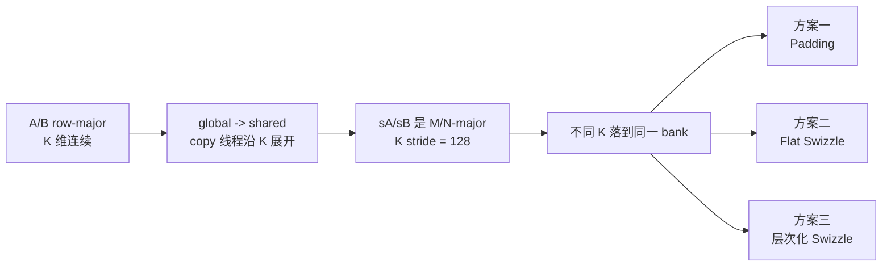
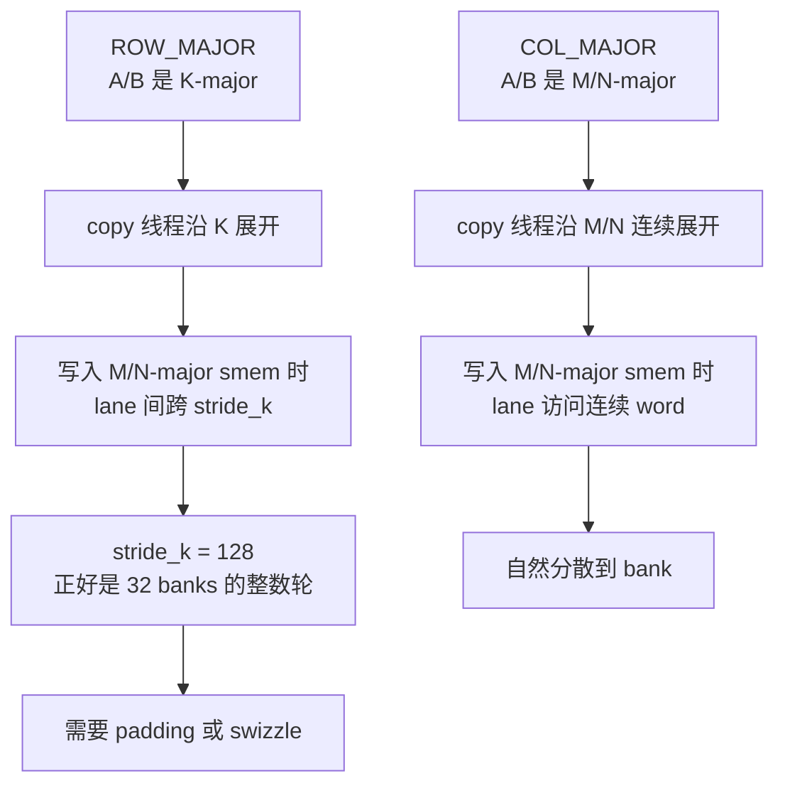
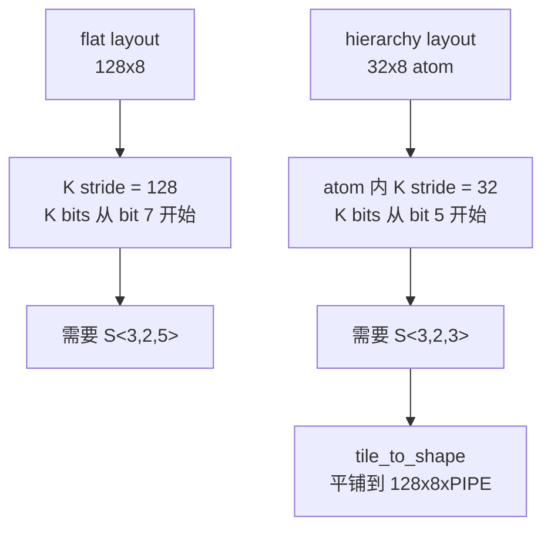
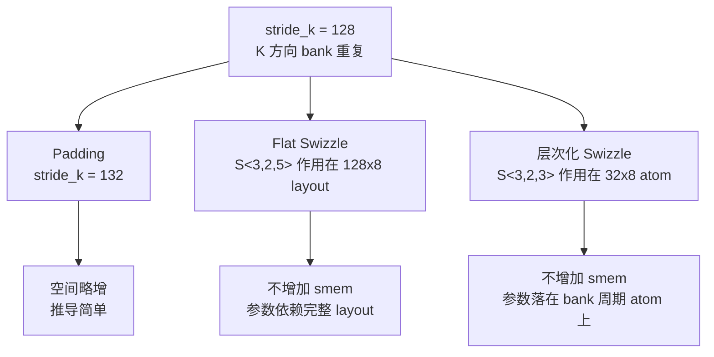

# 动手学 CuTeDSL 07：Shared Memory Bank Conflict 与 Swizzle

## 前言

前面几篇已经介绍了 `Layout`、TV layout、`copy`、`cp.async` 和 `ldmatrix`。这些内容解决了一个问题：**数据如何被线程搬运和消费**。但写高性能 GEMM 时，还要回答另一个同样关键的问题：这些线程访问 shared memory 时，会不会集中打到同一个 bank？

本文以参考实现 [8] 的 FP32 SIMT GEMM 为主线，说明 shared memory bank conflict 是什么，为什么 row-major A/B 在 global-to-shared 写入时会触发冲突，以及如何用 padding 和 CuTe `Swizzle` 解决它。

本文会用三种实现作对比：

- padding 版本：用 `+4 float` padding，把 K 维 stride 从 `128` 改成 `132`。
- flat swizzle 版本：不用 padding，在 flat shared layout 上用 `S<3,2,5>` 改写 shared-memory index。
- 层次化 swizzle 版本：先构造 `32x8` layout atom，再用 `S<3,2,3>` 和 `tile_to_shape` 平铺到完整 shared tile。

主线可以概括成：



读完这一篇后，应该能形成一个判断习惯：分析 shared memory 访问时，先看一个 warp 的同一条 shared-memory 指令，再把每个 lane 的 shared index 映射到 bank。只要这个映射清楚，padding 和 swizzle 都只是改变 index 的不同手段。

## Bank conflict 基础

Shared memory 可以按 32 个 bank 来理解。对 `float32` 这类 32-bit 访问，地址到 bank 的映射是：

```text
bank_id = (byte_address / 4) % 32
```

也可以写成按 `float32` 元素下标取模：

```text
bank_id = element_index % 32
```

一个 bank 不是只有 4 字节容量；更准确地说，每个 bank 的基本访问宽度是 4 字节，也就是一个 32-bit word。shared memory 会把连续的 32-bit word 轮流分配给 32 个 bank：

```text
word 0  -> bank 0
word 1  -> bank 1
...
word 31 -> bank 31
word 32 -> bank 0
```

bank conflict 发生在同一个 warp 的一条 shared-memory 指令里：多个线程访问了同一个 bank 的不同地址，这些访问需要被拆成多轮服务。反过来，如果 32 个线程分别落到 32 个不同 bank，就没有 bank conflict。

这件事之所以值得花一整篇来处理，是因为它直接拖慢访存：`n-way conflict` 意味着这条 shared-memory 指令要被硬件拆成 `n` 轮顺序服务，延迟大致放大 `n` 倍。后文出现的 `8-way conflict` 就意味着同一条指令的访存被串行成 8 轮。

```text
thread i 读取 element[i]      -> bank = i % 32      -> 无冲突
thread i 读取 element[i * 32] -> bank = 0           -> 32-way conflict
```

如果多个线程读的是完全相同的 shared memory 地址，硬件可以做 broadcast，这不是本文讨论的典型 bank conflict。

还需要区分三个容易混在一起的粒度：


| 概念                                | 对应路径                      |               粒度 | 说明                                                                |
| ------------------------------------- | ------------------------------- | -------------------: | --------------------------------------------------------------------- |
| shared memory bank                  | shared 读/写                  |               `4B` | 32 个 bank，连续 32-bit word 映射到连续 bank。                      |
| `cp.async` / LDGSTS per-thread copy | global -> shared              |    `4B / 8B / 16B` | 官方文档支持这三种尺寸；`16B = 128bit` 是常用最大 per-thread 粒度。 |
| global memory transaction           | global -> shared 的 global 读 | `32B / 64B / 128B` | warp 的 global memory 访问会合并成一个或多个自然对齐 transaction。  |

global memory coalescing 说的是：一个 warp 发出的 global memory 访问，如果地址落在连续且对齐的内存段里，硬件会把这些 lane 的访问合并成少量 transaction。transaction 是 global memory 侧真正传输的数据块，常见粒度是 `32B / 64B / 128B`；如果地址不连续或跨越对齐边界，就会拆成更多 transaction。

这和 shared memory bank conflict 是两件事：

```text
global memory coalescing: 看 global 读地址，目标是减少 global transaction 数。
shared memory bank conflict: 看 shared 读/写地址，目标是避免同一条指令里多个 lane 访问同一 bank 的不同地址。
```

`cp.async` 同时涉及两侧：global 侧会考虑 transaction 合并，shared 侧仍然要看写入地址是否造成 bank conflict。

因此，本文后面用 `128B` 分析 shared memory bank pattern，指的是：

```text
32 banks * 4B/bank = 128B
```

也就是一个完整 bank 周期。它不是说 `cp.async` 的最小 copy 粒度是 `128B`。在参考实现 [8] 的 row-major A/B 分支里，global-to-shared 的 copy atom 反而是每线程 `32-bit = 4B`，因为代码为了沿 K 方向搬运而关闭了向量化。

当一个 warp 的单条 shared-memory 指令访问量超过一个 `128B` bank 周期时，分析 bank conflict 应按事务分片分别看，而不是把所有字节混成一个集合。本文的表格都按一个 `128B` bank 周期来分析。

## SGEMM 中冲突从哪里来

本文讨论的 SGEMM 配置使用 A/B row-major：

```bash
--a_major k --b_major k --c_major n
```

A 的逻辑形状是 `[M,K]`，B 的逻辑形状是 `[N,K]`。二者都是 row-major 时，K 是连续维度；在 CuTe/CUTLASS 的 `LayoutEnum` 里对应 `ROW_MAJOR`，也就是 K-major。

但 shared memory 中的 `sA/sB` 被组织成 M/N-major：

```text
sA: (M, K, PIPE), stride=(1, stride_k, ...)
sB: (N, K, PIPE), stride=(1, stride_k, ...)
```

默认 tile 是：

```text
bM = 128
bN = 128
bK = 8
```

如果不用 padding 或 swizzle，那么：

```text
index(major, k) = major + 128 * k
bank(major, k)  = (major + 128 * k) % 32
                 = major % 32
```

也就是说，对固定的 `major`，不同 `k` 切片会反复落到同一个 bank。`sA` 里 `major = m`，`sB` 里 `major = n`。

为什么 row-major 需要处理，而 col-major 在这个实现里不需要同样处理？关键是分清两条 shared memory 路径：


| 路径               | Row-major A/B                        | Col-major A/B                            | shared 侧 layout         | 结论                                                                                  |
| -------------------- | -------------------------------------- | ------------------------------------------ | -------------------------- | --------------------------------------------------------------------------------------- |
| global -> shared   | global 沿 K 连续，copy 线程沿 K 展开 | global 沿 M/N 连续，copy 线程沿 M/N 展开 | `sA/sB` 始终是 M/N-major | row-major 会把同一个`major` 下的多个 K 写到同一 bank；col-major 更接近连续 M/N 写入。 |
| shared -> register | 固定 K，沿 M/N 取 fragment           | 固定 K，沿 M/N 取 fragment               | `sA/sB` 始终是 M/N-major | 两者都主要沿 M/N 读取，访问形状本身更容易分散到不同 bank。                            |

也就是说，这个 GEMM 的矛盾来自两侧 layout 的方向不同：row-major A/B 是 K-major，global-to-shared copy 的 lane 会沿 K 方向展开；但 shared memory 里的 `sA/sB` 为了后续 shared-to-register 读取，始终被组织成 M/N-major。



对 row-major，也就是 K-major 的 A/B，代码使用默认 copy layout：

```python
tA = cute.make_layout((self._num_threads // self._bK, self._bK), stride=(self._bK, 1))
tB = cute.make_layout((self._num_threads // self._bK, self._bK), stride=(self._bK, 1))
```

在默认 `bK = 8` 时，可以把一个 warp 的 lane 粗略理解成：

```text
lane  = major * 8 + k
major = 0..3
k     = 0..7
```

这里 `lane` 是 warp 内线程编号 `0..31`；`major` 是该 lane 写入的连续维坐标（`sA` 是 M、`sB` 是 N），warp 内取 `0..3`；`k` 是 K 维位置。后面的 index/bank 公式都用 `major` 表示这个连续维坐标。

需要强调的是，上面这个分组只是**一种便于分析的代表性线程分布**，并非必然：真实的线程到元素映射由 copy / TV layout 决定，换 tile 形状或 copy layout 后具体编号会不同。这里取它只是为了把冲突讲清楚——结论本身不依赖这个具体编号，只要存在「同一个 `major` 下多个 `k` 被一并写入」的情形，下面的 bank 冲突分析就成立。

不做处理时，同一个 `major` 的 8 个 `k` 会写到：

```text
index = major + k * 128
bank  = (major + k * 128) % 32
      = major
```

这就是 row-major 需要处理的根因：**copy 线程沿 K 变，目标 shared layout 的 K stride 又刚好是 32 个 bank 的整数倍**。

对 col-major，也就是 A 的 M-major / B 的 N-major，代码会改成沿 M/N 连续维做 vectorized copy。源主序和目标 shared layout 主序一致，warp 优先覆盖连续的 M/N 段，每个线程再通过 `vA/vB = (4,1)` 写连续 4 个 `float`，自然按 bank 轮转分布。

所以后面的 padding、flat swizzle、hierarchy swizzle 主要都是在处理 **row-major A/B 的 global-to-shared 写入**。

## 方案一：Padding

冲突的根因是 `stride_k = 128` 恰好是 32 个 bank 的整数倍，于是不同 `k` 都落回同一 bank。padding 的思路最直接：把这个 stride 改成不是 32 的整数倍，让相邻 `k` 自动错开 bank。具体做法是给 K-major 情况加 4 个 `float` padding：

```python
padding_a = 4 if self.a_major_mode == utils.LayoutEnum.ROW_MAJOR else 0
padding_b = 4 if self.b_major_mode == utils.LayoutEnum.ROW_MAJOR else 0

sA_layout = cute.make_layout(
    (self._bM, self._bK, self._num_stages),
    stride=(1, (self._bM + padding_a), self._bK * (self._bM + padding_a)),
)
sB_layout = cute.make_layout(
    (self._bN, self._bK, self._num_stages),
    stride=(1, (self._bN + padding_b), self._bK * (self._bN + padding_b)),
)
```

加 padding 后，K 维 stride 从 `128` 变成 `132`：

```text
index(major, k) = major + 132 * k
bank(major, k)  = (major + 132 * k) % 32
                 = (major + 4 * k) % 32
```

所以每推进一个 `k`，bank 会错开 4 个位置：

```text
k = 0: bank = major
k = 1: bank = major + 4
k = 2: bank = major + 8
...
```

用默认尺寸看一个完整 warp 的 row-major 写入。此时每个 lane 写一个 `float32 = 4B`，一个 warp 一次写：

```text
32 lanes * 4B = 128B
```

这正好覆盖一个完整 bank 周期。默认 copy layout 仍按前面 SGEMM 章给出的代表性分布 `lane = major * 8 + k`（`major = 0..3`、`k = 0..7`）来看。无 padding 时：

```text
index = major + 128 * k
bank  = major
```


| lane 分组                | 写入坐标`(major,k)` | bank 分布         | 结果                                   |
| -------------------------- | --------------------- | ------------------- | ---------------------------------------- |
| `major=0`, lane `0..7`   | `(0,0)..(0,7)`      | `0,0,0,0,0,0,0,0` | bank 0 上 8 个不同地址，8-way conflict |
| `major=1`, lane `8..15`  | `(1,0)..(1,7)`      | `1,1,1,1,1,1,1,1` | bank 1 上 8 个不同地址，8-way conflict |
| `major=2`, lane `16..23` | `(2,0)..(2,7)`      | `2,2,2,2,2,2,2,2` | bank 2 上 8 个不同地址，8-way conflict |
| `major=3`, lane `24..31` | `(3,0)..(3,7)`      | `3,3,3,3,3,3,3,3` | bank 3 上 8 个不同地址，8-way conflict |

加 4 个 `float` padding 后：

```text
index = major + 132 * k
bank  = major + 4 * k mod 32
```


| lane 分组                | 写入坐标`(major,k)` | bank 分布               | 结果             |
| -------------------------- | --------------------- | ------------------------- | ------------------ |
| `major=0`, lane `0..7`   | `(0,0)..(0,7)`      | `0,4,8,12,16,20,24,28`  | 分散到 8 个 bank |
| `major=1`, lane `8..15`  | `(1,0)..(1,7)`      | `1,5,9,13,17,21,25,29`  | 分散到 8 个 bank |
| `major=2`, lane `16..23` | `(2,0)..(2,7)`      | `2,6,10,14,18,22,26,30` | 分散到 8 个 bank |
| `major=3`, lane `24..31` | `(3,0)..(3,7)`      | `3,7,11,15,19,23,27,31` | 分散到 8 个 bank |

合起来看，这 32 个 lane 正好落到 32 个不同 bank，所以这一批 `128B` 写入没有 bank conflict。若某条 shared-memory 指令的访问量超过 `128B`，仍应按每个 `128B` 事务分片重复这个分析。

padding 的优点是简单、稳定、地址计算直观。代价是多占一点 shared memory。默认配置下，每个 operand 多：

```text
4 padding elements * 8 K * 3 stages = 96 float
```

对 A/B 合计是 `192 float = 768B`。这个开销不大，但 padding 的本质仍然是“用空间换 bank skew”。

## Swizzle 原理

在看具体规则之前，先建立一个直觉对照：padding 是「用空间换错位」——多塞几个元素，让相邻 `k` 的地址自然错开 bank；swizzle 则是「不加空间、直接打乱 index 的某些 bit」来达成同样的错位。两者目标一致，都是改变「逻辑坐标 -> shared-memory index」的映射，区别只在用什么手段去改。

CuTe `Swizzle` 是一个作用在线性 index 上的地址变换。放到 shared memory 地址语境里，这个 index 也常被称为 element offset。普通 layout 先把逻辑坐标映射成 index：

```text
layout: coord -> index
```

swizzle 再把这个 index 改写成新的 shared-memory index：

```text
swizzle: index -> index'
```

组合起来就是：

```text
coord -> layout(coord) -> swizzle(layout(coord))
```

CuTe 的 `S<B,M,S>` 可以按下面的 bit 图理解：

```text
0bxxxxxxxxxxxxxxxYYYxxxxxxxZZZxxxx
                              ^--^ MBase (least-sig bits kept constant)
                 ^-^       ^-^     BBits (number of bits in mask)
                   ^---------^     SShift (distance to shift YYY)
                                      (positive: right, negative: left)

Given:    0bxxxxxxxxxxxxxxxYYYxxxxxxxZZZxxxx
Result:   0bxxxxxxxxxxxxxxxYYYxxxxxxxAAAxxxx
          where AAA = ZZZ xor YYY
```

这里使用 xor，是因为固定 `YYY` 时，`ZZZ -> ZZZ xor YYY` 是双射：不同的 `ZZZ` 不会映射到同一个结果，并且再 xor 一次同一个 `YYY` 就能还原。swizzle 因此能重排 bank 选择位，同时不改变元素总数，也不会制造地址重叠。

三个参数的含义是：

- `M` / `MBase`：最低多少个 bit 保持不变，通常对应一个局部连续向量内部的位置。
- `B` / `BBits`：参与 xor 的 bit 数，也就是要打散多少个向量块编号 bit。
- `S` / `SShift`：高位 mask 与低位 mask 的距离，决定从哪里取高位信息 xor 到低位块编号。

用一个 `8x8` 小例子更直观。假设 shared memory 也简化成 `8` 个 bank，每个 bank 每次可以服务 `1` 个元素：

```text
bank = index % 8
```

先看一个普通 row-major layout：

```python
base_layout = cute.make_layout((8, 8), stride=(8, 1))
```

也就是：

```text
index = row * 8 + col
```

`cute-viz` 图里的横纵坐标是逻辑坐标 `(row, col)`，格子里的数字是这个坐标映射到的线性 `index`：


这个 layout 按行访问没有冲突：一行的 `index = 0..7` 会落到 bank `0..7`。但按列访问会冲突：固定 `col` 时，`index = col, 8 + col, 16 + col, ...`，这些值对 `8` 取模都等于同一个 `col`。

对它加上 `S<3,0,3>`：

```python
swizzled_layout = cute.make_composed_layout(
    cute.make_swizzle(3, 0, 3), 0, base_layout
)
```

在这个例子里，`M=0` 不保留额外低位，`B=3` 表示改写低 3 个 bit，也就是 `col`；`S=3` 表示源 bits 从低位 mask 向高位偏移 3 位，在 `8x8` row-major layout 中正好对应 `row`。因此可以近似看成：

```text
index' = row * 8 + (col xor row)
```

`cute-viz` 展示的就是 swizzle 后每个逻辑坐标对应的新 `index'`：


读图时重点看“同一列”的数字：例如 `col=0` 这一列从 `0,8,16,...` 变成 `0,9,18,...`，对 `8` 取模后会落到不同 bank。固定 `row` 时，`col xor row` 也是 `0..7` 的一个排列，所以行访问仍然覆盖 8 个不同 bank。换句话说，swizzle 没有改变逻辑坐标，也没有减少元素；它只是改变逻辑坐标到 shared-memory index 的映射，让原本集中到同一 bank 的列访问被打散。

对于上面这个行主序并且 `B=S=3` 的例子，也可以更形象地理解：最低 `2^M` 个元素组成一个 cell；接下来的 `S` 个 bit 表示 cell 二维排布的列编号；再向高位取到另一组 `B` 个 bit 作为行编号。swizzle 会用行编号 xor 列编号，得到新的列编号。具体可以看 [7] 中的示意图和解释。


因此，选择 swizzle 参数时要先回答三件事：

```text
1. 哪一段低位必须保持连续？即M如何设置
2. 要打散几个 bit？即B如何设置
3. 冲突来源的高位从 index 的哪一位开始？即S如何设置
```

## 方案二：Flat Swizzle

第二种方案是不加 padding，而是构造无 padding 的基础 layout，再用 `Swizzle` 改写逻辑坐标到 shared-memory index 的映射：

```python
base_layout = cute.make_layout(
    (major_extent, k_extent, num_stages),
    stride=(1, major_extent, k_extent * major_extent),
)
```

然后在 K-major 情况下组合 swizzle：

```python
return cute.make_composed_layout(
    cute.make_swizzle(3, 2, 5), 0, base_layout
)
```

完整 helper 是：

```python
@cute.jit
def _make_smem_layout(
    self,
    major_extent: cutlass.Constexpr,
    k_extent: cutlass.Constexpr,
    num_stages: cutlass.Constexpr,
    major_mode: cutlass.Constexpr,
):
    base_layout = cute.make_layout(
        (major_extent, k_extent, num_stages),
        stride=(1, major_extent, k_extent * major_extent),
    )
    if cutlass.const_expr(major_mode == utils.LayoutEnum.ROW_MAJOR):
        return cute.make_composed_layout(
            cute.make_swizzle(3, 2, 5), 0, base_layout
        )
    return cute.make_composed_layout(
        cute.make_swizzle(0, 2, 5), 0, base_layout
    )
```

这里用 `S<3,2,5>`，也就是 `cute.make_swizzle(3, 2, 5)`。它是针对当前默认 FP32 `128x128x8` tile 推出来的：

```text
index = major + 128 * k
128    = 2^7
bK     = 8 = 2^3
```

### 为什么是 `MBase = 2`

`float32` 一个元素 4B。这里保留连续 4 个 value，是为了保留 `16B = 128bit` 的局部向量粒度；它对应常见最大 per-thread copy / vector load 粒度。对 FP32 来说：

```text
4 float = 16B
```

保留最低 2 个元素 bit，就能保留 4 个 `float32` 的局部连续性：

```text
2^2 = 4 elements = 16B
```

所以 `MBase = 2`。

### 为什么是 `BBits = 3`

当前 `bK = 8`，K tile 内有 8 个 K 位置：

```text
8 = 2^3
```

我们希望把这 3 个 K bit 打散到 bank-select bits 上，所以 `BBits = 3`。

### 为什么是 `SShift = 5`

无 padding 时：

```text
index = major + 128 * k = major + 2^7 * k
```

K bit 从 index 的 bit 7 开始。我们保留最低 2 bit 后，希望改写 bit 2..4 这三个 bank-select bit。因此位移距离是：

```text
7 - 2 = 5
```

所以 `SShift = 5`。

直观上，swizzle 后 bank 不再只是：

```text
bank = major % 32
```

而是把 `k` 相关 bit xor 到 `major` 的 bank-select bits 中。可以近似理解为：

```text
bank = (major & 3) + 4 * (((major >> 2) & 7) xor k)
```

这样固定 `major`、不同 `k` 会落到不同 bank 组，达到和 padding 类似的 bank skew 效果，但不增加 shared memory 占用。下图展示了 swizzle 后，坐标和实际索引（index，也常称 offset）的对应关系。


对一个 warp，flat swizzle 前后的 bank 分布如下。无 swizzle 时仍然是：

```text
bank = major
```

表中的 `index` 是 shared memory 的 element index，也常称为 element offset；FP32 时 `bank = index % 32`。`S<3,2,5>` 后的 `index` 与上方 cute-viz 图中的单元格数字一致。


| lane 分组                | 访问坐标`(major,k)` | index 分布                      | bank 分布         | 结果                     |
| -------------------------- | --------------------- | --------------------------------- | ------------------- | -------------------------- |
| `major=0`, lane `0..7`   | `(0,0)..(0,7)`      | `0,128,256,384,512,640,768,896` | `0,0,0,0,0,0,0,0` | bank 0 上 8-way conflict |
| `major=1`, lane `8..15`  | `(1,0)..(1,7)`      | `1,129,257,385,513,641,769,897` | `1,1,1,1,1,1,1,1` | bank 1 上 8-way conflict |
| `major=2`, lane `16..23` | `(2,0)..(2,7)`      | `2,130,258,386,514,642,770,898` | `2,2,2,2,2,2,2,2` | bank 2 上 8-way conflict |
| `major=3`, lane `24..31` | `(3,0)..(3,7)`      | `3,131,259,387,515,643,771,899` | `3,3,3,3,3,3,3,3` | bank 3 上 8-way conflict |

`S<3,2,5>` 后：


| lane 分组                | 访问坐标`(major,k)` | index 分布                      | bank 分布               | 结果             |
| -------------------------- | --------------------- | --------------------------------- | ------------------------- | ------------------ |
| `major=0`, lane `0..7`   | `(0,0)..(0,7)`      | `0,132,264,396,528,660,792,924` | `0,4,8,12,16,20,24,28`  | 分散到 8 个 bank |
| `major=1`, lane `8..15`  | `(1,0)..(1,7)`      | `1,133,265,397,529,661,793,925` | `1,5,9,13,17,21,25,29`  | 分散到 8 个 bank |
| `major=2`, lane `16..23` | `(2,0)..(2,7)`      | `2,134,266,398,530,662,794,926` | `2,6,10,14,18,22,26,30` | 分散到 8 个 bank |
| `major=3`, lane `24..31` | `(3,0)..(3,7)`      | `3,135,267,399,531,663,795,927` | `3,7,11,15,19,23,27,31` | 分散到 8 个 bank |

同样，32 个 lane 落到 32 个不同 bank，无 bank conflict。

上表分析的是 global-to-shared 写入。shared-to-register 读取时，代码固定一个 `k_block`，主要沿 M/N-major 的 `major` 维读连续元素。flat swizzle 不会破坏这个性质：在固定 `k` 时，`S<3,2,5>` 只是把 `major` 的 bank-select bits 做 xor 重排，`major = 0..31` 仍然是一组 32 个不同 bank；同时 `MBase = 2` 保留最低 2 bit，所以每线程连续 4 个 `float32` 仍然保持局部连续。

因此，swizzle 解决 global-to-shared 写入冲突的同时，不会把原本沿 M/N-major 连续读取的 shared-to-register 路径变成典型 bank conflict。

## 方案三：层次化 Swizzle

方案三使用另一种 swizzle 写法，这也是更常用的写法：先构造一个更小的 `32x8` layout atom，再用 `tile_to_shape` 平铺成完整的 `(128, 8, PIPE)` shared tile。

为什么 atom 是 `32x8`？

- `32` 来自一个完整 shared-memory bank 周期。FP32 一个元素是 `4B`，Ampere shared memory 可以按 `32` 个 bank、每个 bank `4B` 理解，所以一个 `128B` bank 周期正好是 `32` 个 FP32 元素。
- `8` 来自默认 `bK = 8`。当前冲突要把 `k = 0..7` 这 3 个 K bit 全部打散，因此 atom 的 K 维需要覆盖这 8 个位置。

所以 `32x8` 是默认 FP32 `128x128x8` SGEMM 下的最小自然单元：

```text
major 方向: 32 FP32 = 128B = 一个完整 bank 周期
K 方向:     8       = 当前 CTA K tile 内全部 K 位置
```

能不能更小？一般不建议。比如把 major atom 缩成 `16x8`，它只覆盖 `64B`，还没满一个 bank 周期；`tile_to_shape` 平铺后，同一个 `128B` 访问窗口里会出现两个重复的半周期 bank pattern，容易让原本应覆盖 `32` 个 bank 的 M/N-major 读取出现重复 bank。把 K atom 缩成 `32x4` 也不够，因为只能区分 2 个 K bit，`k` 和 `k+4` 的 bank pattern 会重复。

更大的 atom 可以做，但没有必要：它超过一个 `128B` bank 周期，分析复杂度更高，也失去了让 `K stride = 32`、从而使用 `S<3,2,3>` 的简洁推导。

核心 helper 是：

```python
@cute.jit
def _make_smem_layout(
    self,
    major_extent: cutlass.Constexpr,
    k_extent: cutlass.Constexpr,
    num_stages: cutlass.Constexpr,
    major_mode: cutlass.Constexpr,
):
    base_layout = cute.make_layout(
        (major_extent, k_extent, num_stages),
        stride=(1, major_extent, k_extent * major_extent),
    )
    if cutlass.const_expr(major_mode == utils.LayoutEnum.ROW_MAJOR):
        layout_atom_outer = cute.make_layout(
            (32, k_extent), stride=(1, 32)
        )
        layout_atom = cute.make_composed_layout(
            cute.make_swizzle(3, 2, 3), 0, layout_atom_outer
        )
        return cute.tile_to_shape(
            layout_atom,
            (major_extent, k_extent, num_stages),
            (0, 1, 2),
        )
    return cute.make_composed_layout(
        cute.make_swizzle(0, 2, 5), 0, base_layout
    )
```

这里的关键是先改变 swizzle 作用的基础 layout atom，再利用 tile_to_shape 把单个 swizzled atom 扩展到完整的 shared memory tile。

### 为什么是 `MBase = 2`

层次化版本仍然是 FP32 SIMT SGEMM，shared-to-register 读取仍然希望每个线程拿连续 4 个 `float32`：

```text
4 float32 = 16B = 2^2 elements
```

因此最低 2 个元素 bit 必须保持不变：

```text
MBase = 2
```

### 为什么是 `BBits = 3`

默认 K tile 大小仍然是：

```text
bK = 8 = 2^3
```

这里继续沿用 `major` 表示连续维坐标，只是限定在单个 `32x8` atom 内，取值 `0..31`（完整 `128` 宽的 tile 由 4 个这样的 atom 平铺而成）。row-major A/B 的冲突来自同一个 `major` 下 8 个不同 K 位置落到同一批 bank。要把 `k=0..7` 全部打散，就需要 3 个 K bit 参与 xor：

```text
BBits = 3
```

### 为什么是 `SShift = 3`

在 `S<B,M,S>` 里，最低 `M` 个 bit 保持不变；要被 xor 改写的低位 mask 从 bit `M` 开始；参与 xor 的高位 mask 从 bit `M + S` 开始。

层次化版本把基础 atom 设成 `32x8`，所以：

```text
index = major + 32 * k
32    = 2^5
```

也就是说，K bit 从 index bit 5 开始。当前 `M = 2`，低位 mask 从 bit 2 开始。要让高位 mask 正好取到 K bit，就需要：

```text
M + S = 5
S     = 5 - M = 5 - 2 = 3
```

这里也能看到 `32x8` atom 的好处：在 FP32 下，

```text
2^(M+S) elements = 2^5 FP32 = 32 * 4B = 128B
```

这正好是一个 shared-memory bank 周期。也就是说，方案三把 swizzle 的基础单元对齐到一个 `128B` bank 周期，再在这个周期内把 K bit xor 到 bank-select bits 上。

因此：

```text
MBase = 2
SShift = 5 - 2 = 3
```

也就是：

```text
S<3,2,3>
```

直观上，这相当于把原来的 `128x8` shared tile 切成 4 个 `32x8` atom：



在单个 `32x8` atom 内，可以近似理解为：

```text
bank = (major & 3) + 4 * (((major >> 2) & 7) xor k)
```

它和 flat `S<3,2,5>` 的目标相同：保留 4 个 FP32 的局部连续性，同时把 `k` 的 3 个 bit xor 到 bank-select bits 上。区别是物理 layout 不同。下图展示了 swizzle 后，坐标和实际索引（index，也常称 offset）的对应关系。


对一个 warp，hierarchy swizzle 前后的 bank 分布如下。无 swizzle 时：

表读法同方案二：`S<3,2,3>` 后的 `index` 与上方 cute-viz 图中的单元格数字一致（FP32 下 `bank = index % 32`）。


| lane 分组                | 访问坐标`(major,k)` | index 分布                   | bank 分布         | 结果                     |
| -------------------------- | --------------------------- | ------------------------------ | ------------------- | -------------------------- |
| `major=0`, lane `0..7`   | `(0,0)..(0,7)`            | `0,32,64,96,128,160,192,224` | `0,0,0,0,0,0,0,0` | bank 0 上 8-way conflict |
| `major=1`, lane `8..15`  | `(1,0)..(1,7)`            | `1,33,65,97,129,161,193,225` | `1,1,1,1,1,1,1,1` | bank 1 上 8-way conflict |
| `major=2`, lane `16..23` | `(2,0)..(2,7)`            | `2,34,66,98,130,162,194,226` | `2,2,2,2,2,2,2,2` | bank 2 上 8-way conflict |
| `major=3`, lane `24..31` | `(3,0)..(3,7)`            | `3,35,67,99,131,163,195,227` | `3,3,3,3,3,3,3,3` | bank 3 上 8-way conflict |

`S<3,2,3>` 后：


| lane 分组                | 访问坐标`(major,k)` | index 分布                    | bank 分布               | 结果             |
| -------------------------- | --------------------------- | ------------------------------- | ------------------------- | ------------------ |
| `major=0`, lane `0..7`   | `(0,0)..(0,7)`            | `0,36,72,108,144,180,216,252` | `0,4,8,12,16,20,24,28`  | 分散到 8 个 bank |
| `major=1`, lane `8..15`  | `(1,0)..(1,7)`            | `1,37,73,109,145,181,217,253` | `1,5,9,13,17,21,25,29`  | 分散到 8 个 bank |
| `major=2`, lane `16..23` | `(2,0)..(2,7)`            | `2,38,74,110,146,182,218,254` | `2,6,10,14,18,22,26,30` | 分散到 8 个 bank |
| `major=3`, lane `24..31` | `(3,0)..(3,7)`            | `3,39,75,111,147,183,219,255` | `3,7,11,15,19,23,27,31` | 分散到 8 个 bank |

同样，32 个 lane 落到 32 个不同 bank，无 bank conflict。

- flat swizzle：在完整 `(128,8,PIPE)` layout 上直接改写地址位；
- hierarchy swizzle：先在 `32x8` layout atom 内改写地址位，再平铺到完整 shared tile。

所以结论是：

```text
flat layout + S<3,2,3>：不对，K bits 没有完整参与 xor。
32x8 atom + S<3,2,3> + tile_to_shape：可以，atom 内 K bits 正好位于 bit 5..7。
```

上表同样只分析 global-to-shared 写入；shared-to-register 读取与 flat swizzle 同理：在单个 `32x8` atom 内固定 `k` 时，`major = 0..31` 仍映射到 32 个不同 bank，`MBase = 2` 也保留每线程连续 4 个 `float32` 的局部连续性，所以不会把读取路径变成典型 bank conflict。

## 小结

这一篇的核心不是记住某个固定参数，而是掌握 shared memory bank conflict 的分析方法：

```text
1. 选定 warp 中的一条 shared-memory 指令。
2. 写出每个 lane 访问的 shared-memory index。
3. 用 bank = index % 32 判断是否多个不同地址落到同一 bank。
4. 如果冲突，就用 padding 或 swizzle 改变 index 映射。
```

回到本文的 SGEMM，问题可以压缩成一条链路：

```text
row-major A/B
=> global-to-shared copy 沿 K 展开
=> 写入 M/N-major sA/sB 时 K stride = 128
=> 不同 k 反复落到同一 bank
```

三种解决方式分别是：



padding 是最直接的办法：把 `stride_k` 从 `128` 改成 `132`，让不同 `k` 错开 bank。swizzle 则不改变逻辑 shape，而是改写 shared-memory index 的低位 bank-select bits。flat swizzle 直接作用在完整 `(128,8,PIPE)` layout 上，所以需要 `S<3,2,5>`；层次化 swizzle 先把问题放进一个 `32x8` bank 周期 atom 里，所以可以用更局部的 `S<3,2,3>`。

三种方案横向对比如下：


| 维度             | 方案一 Padding                  | 方案二 Flat Swizzle              | 方案三 层次化 Swizzle                     |
| ------------------ | --------------------------------- | ---------------------------------- | ------------------------------------------- |
| 核心手段         | `stride_k` 从 `128` 改 `132`    | `S<3,2,5>` 作用在完整 `128x8`    | `S<3,2,3>` 作用在 `32x8` atom 后平铺      |
| 额外 shared memory | 有，A/B 合计约 `768B`           | 无                               | 无                                        |
| 参数推导依据     | bank 错开 4，地址算式直观        | 依赖完整 layout 的 K bit 位置（bit 7） | 参数落在一个 `128B` bank 周期 atom 内（K bit 位 5） |
| 推导/分析难度    | 最低                            | 中（需定位完整 layout 的高位）   | 中（atom 内推导更局部，但多一步 `tile_to_shape`） |
| 适用场景         | 快速验证、对 smem 余量不敏感时   | 想省 smem 且 tile 形状固定        | 通用写法，参数随 atom 复用，最常用        |

三者效果一致：都让一个 warp 的 `128B` 写入落到 32 个不同 bank，消除 bank conflict。选择主要看是否在意 smem 占用，以及是否需要可复用、可随 tile 缩放的 swizzle 参数。

还要注意，本文主要解决的是 row-major A/B 的 **global-to-shared 写入**冲突。shared-to-register 读取阶段依赖 M/N-major 的 shared layout ，访问形状本身更连续，没有 bank conflict。

## 参考

1. [NVIDIA CUDA C++ Programming Guide: Shared Memory](https://docs.nvidia.com/cuda/cuda-c-programming-guide/#shared-memory-5-x)：32 个 bank、连续 32-bit word 映射到连续 bank。
2. [NVIDIA CUDA C++ Programming Guide: Asynchronous Data Copies](https://docs.nvidia.com/cuda/cuda-programming-guide/04-special-topics/async-copies.html)：LDGSTS / `cp.async` 支持 4、8、16B，16B 时可走 L1 bypass，128B 是推荐对齐粒度之一。
3. [NVIDIA PTX ISA: `cp.async`](https://docs.nvidia.com/cuda/parallel-thread-execution/index.html)：`cp.async` 的 `cp-size` 只能是 4、8、16 bytes。
4. [NVIDIA CUDA C++ Programming Guide: Device Memory Accesses](https://docs.nvidia.com/cuda/cuda-c-programming-guide/#device-memory-accesses)：global memory transaction 可以是 32、64、128B。
5. [NVIDIA CUTLASS Python DSL Types: Swizzle](https://docs.nvidia.com/cutlass/latest/media/docs/pythonDSL/cute_dsl_general/types.html#swizzle)：`Swizzle` 参数和 `ComposedLayout` 语义。
6. [NVIDIA CUTLASS: Efficient GEMM in CUDA](https://docs.nvidia.com/cutlass/latest/media/docs/cpp/efficient_gemm.html)：GEMM 的 warp-level 阶段会从 shared memory 取数，shared memory access 应尽量 bank-conflict free。
7. [CuTe 之 Swizzle](https://zhuanlan.zhihu.com/p/671419093)
8. [ampere/sgemm.py](https://github.com/nvidia/cutlass/blob/main/examples/python/CuTeDSL/cute/ampere/kernel/dense_gemm/sgemm.py)
