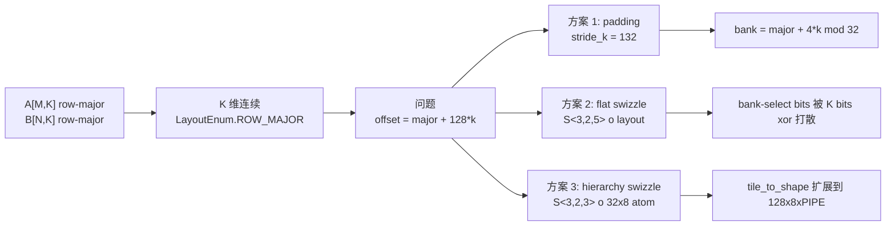
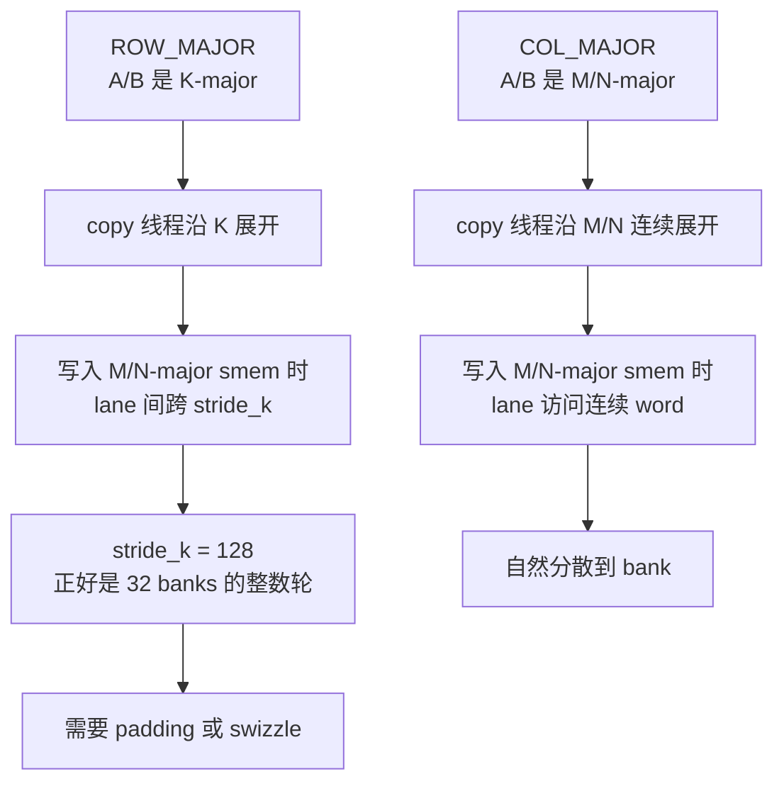
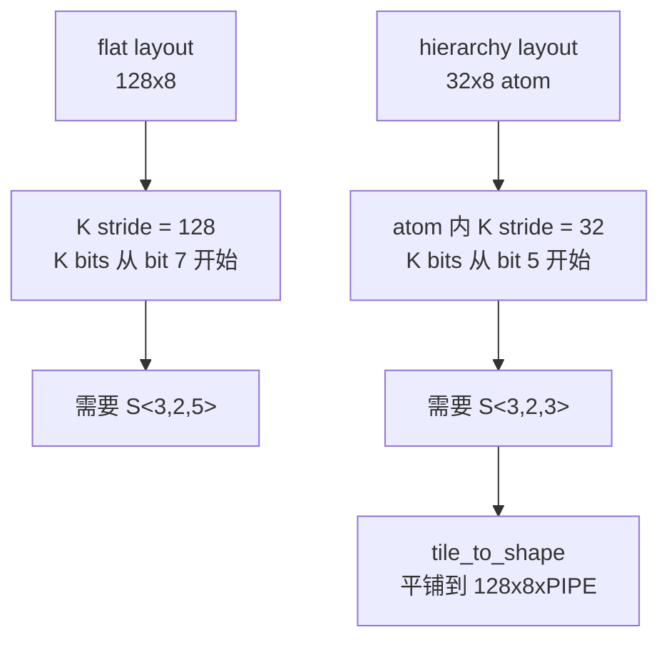
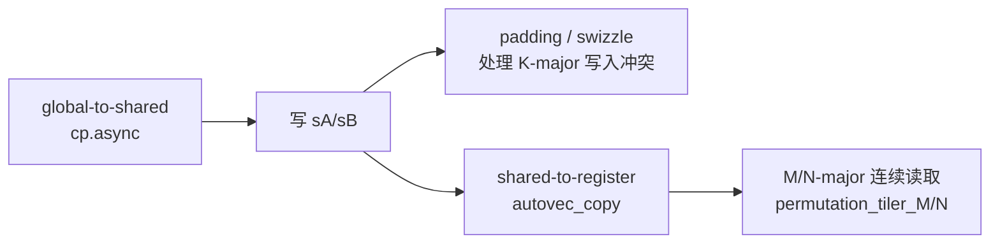
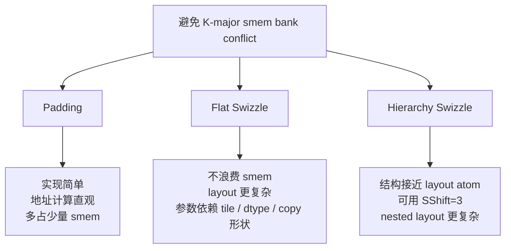

# SGEMM 如何避免 Shared Memory Bank Conflict

结论：`ampere/sgemm.py`、`ampere/sgemm_swizzle.py` 和 `ampere/sgemm_swizzle_hierarchy.py` 展示了三种解决同一个 bank conflict 的方案。
这个 conflict 主要来自 A/B row-major 时的 global-to-shared 写入路径；shared-to-register 读取路径是另一件事，代码把它设计成 bank-friendly，但不能只看 Python 源码就宣称每条 shared load 都严格保证 0 conflict。

- `sgemm.py`：用 `+4 float` padding，把 K 维 stride 从 `128` 改成 `132`。
- `sgemm_swizzle.py`：不用 padding，在 flat shared layout 上用 `S<3,2,5>` 改写 shared-memory offset。
- `sgemm_swizzle_hierarchy.py`：先构造 `32x8` layout atom，再用 `S<3,2,3>` 和 `tile_to_shape` 扩展到完整 shared tile。



## Bank conflict 基础

Ampere 上 shared memory 可以按 32 个 bank 来理解。对 `float32` 这类 32-bit 访问，地址到 bank 的映射是：

```text
bank_id = (byte_address / 4) % 32
```

也可以写成按 `float32` 元素下标取模：

```text
bank_id = element_offset % 32
```

一个 bank 不是只有 4 字节容量；更准确地说，每个 bank 的基本访问宽度是 4 字节，也就是一个 32-bit word。shared memory 会把连续的 32-bit word 轮流分配给 32 个 bank：

```text
word 0  -> bank 0
word 1  -> bank 1
...
word 31 -> bank 31
word 32 -> bank 0
```

bank conflict 发生在同一个 warp 的一条 shared-memory 指令里：多个线程访问了同一个 bank 的不同地址，这些访问需要被拆成多轮服务。反过来，如果 32 个线程分别落到 32 个不同 bank，就没有 bank conflict。

```text
thread i 读取 element[i]      -> bank = i % 32      -> 无冲突
thread i 读取 element[i * 32] -> bank = 0           -> 32-way conflict
```

如果多个线程读的是完全相同的 shared memory 地址，硬件可以做 broadcast，这不是本文讨论的典型 bank conflict。

## 问题来源

当前脚本都使用 A/B row-major：

```bash
--a_major k --b_major k --c_major n
```

A 的逻辑形状是 `[M,K]`，B 的逻辑形状是 `[N,K]`。二者都是 row-major 时，K 是连续维度；在 CuTe/CUTLASS 的 `LayoutEnum` 里对应 `ROW_MAJOR`，也就是 K-major。

但 shared memory 中的 `sA/sB` 被组织成 M/N-major：

```text
sA: (M, K, PIPE), stride=(1, stride_k, ...)
sB: (N, K, PIPE), stride=(1, stride_k, ...)
```

默认 tile 是：

```text
bM = 128
bN = 128
bK = 8
```

如果不用 padding 或 swizzle，那么：

```text
offset(major, k) = major + 128 * k
bank(major, k)   = (major + 128 * k) % 32
                 = major % 32
```

也就是说，对固定的 `major`，不同 `k` 切片会反复落到同一个 bank。`sA` 里 `major = m`，`sB` 里 `major = n`。

## 为什么 row-major 需要处理，col-major 不需要

`sgemm.py` 里真正的差异是：global memory 的主序不同，会导致 global-to-shared copy 的线程排布不同；而 shared memory 里的 `sA/sB` 始终被组织成 M/N-major。



对 row-major，也就是 K-major 的 A/B，代码使用默认 copy layout：

```python
tA = cute.make_layout((self._num_threads // self._bK, self._bK), stride=(self._bK, 1))
tB = cute.make_layout((self._num_threads // self._bK, self._bK), stride=(self._bK, 1))
```

在默认 `bK = 8` 时，一个 warp 的 lane 可以粗略理解成：

```text
lane  = outer * 8 + k
outer = 0..3
k     = 0..7
```

不做处理时，同一个 `outer` 的 8 个 `k` 会写到：

```text
offset = outer + k * 128
bank   = (outer + k * 128) % 32
       = outer
```

这就是 row-major 需要处理的根因：**copy 线程沿 K 变，目标 shared layout 的 K stride 又刚好是 32 个 bank 的整数倍**。

对 col-major，也就是 A 的 M-major / B 的 N-major，代码会改成沿 M/N 连续维做 vectorized copy。源主序和目标 shared layout 主序一致，warp 优先覆盖连续的 M/N 段，每个线程再通过 `vA/vB = (4,1)` 写连续 4 个 `float`，自然按 bank 轮转分布。

## 方案一：Padding

`sgemm.py` 的实现是给 K-major 情况加 4 个 `float` padding：

```python
padding_a = 4 if self.a_major_mode == utils.LayoutEnum.ROW_MAJOR else 0
padding_b = 4 if self.b_major_mode == utils.LayoutEnum.ROW_MAJOR else 0

sA_layout = cute.make_layout(
    (self._bM, self._bK, self._num_stages),
    stride=(1, (self._bM + padding_a), self._bK * (self._bM + padding_a)),
)
sB_layout = cute.make_layout(
    (self._bN, self._bK, self._num_stages),
    stride=(1, (self._bN + padding_b), self._bK * (self._bN + padding_b)),
)
```

加 padding 后，K 维 stride 从 `128` 变成 `132`：

```text
offset(major, k) = major + 132 * k
bank(major, k)   = (major + 132 * k) % 32
                 = (major + 4 * k) % 32
```

所以每推进一个 `k`，bank 会错开 4 个位置：

```text
k = 0: bank = major
k = 1: bank = major + 4
k = 2: bank = major + 8
...
```

优点是简单、稳定、地址计算直观。代价是多占一点 shared memory。默认配置下，每个 operand 多：

```text
4 padding elements * 8 K * 3 stages = 96 float
```

对 A/B 合计也只有 `192 float = 768B`。

## 方案二：Flat Swizzle

`sgemm_swizzle.py` 不加 padding，而是构造无 padding 的基础 layout：

```python
base_layout = cute.make_layout(
    (major_extent, k_extent, num_stages),
    stride=(1, major_extent, k_extent * major_extent),
)
```

然后在 K-major 情况下组合 swizzle：

```python
return cute.make_composed_layout(
    cute.make_swizzle(3, 2, 5), 0, base_layout
)
```

完整 helper 是：

```python
@cute.jit
def _make_smem_layout(
    self,
    major_extent: cutlass.Constexpr,
    k_extent: cutlass.Constexpr,
    num_stages: cutlass.Constexpr,
    major_mode: cutlass.Constexpr,
):
    base_layout = cute.make_layout(
        (major_extent, k_extent, num_stages),
        stride=(1, major_extent, k_extent * major_extent),
    )
    if cutlass.const_expr(major_mode == utils.LayoutEnum.ROW_MAJOR):
        return cute.make_composed_layout(
            cute.make_swizzle(3, 2, 5), 0, base_layout
        )
    return cute.make_composed_layout(
        cute.make_swizzle(0, 2, 5), 0, base_layout
    )
```

CuTe `Swizzle` 的三个参数可以按官方文档理解为：

- `MBase`：保留最低多少个 bit 不变；
- `BBits`：参与 xor 的 mask bit 数；
- `SShift`：另一组 bit 与当前 mask bit 的距离。

这里用 `S<3,2,5>`，也就是 `cute.make_swizzle(3, 2, 5)`。它是针对当前默认 FP32 `128x128x8` tile 推出来的：

```text
offset = major + 128 * k
128    = 2^7
bK     = 8 = 2^3
```

### 为什么是 `MBase = 2`

`float32` 一个元素 4B。每个线程在 shared-to-register 路径里希望拿连续 4 个 value，也就是：

```text
4 float = 16B
```

保留最低 2 个元素 bit，就能保留 4 个 `float32` 的局部连续性：

```text
2^2 = 4 elements = 16B
```

所以 `MBase = 2`。

### 为什么是 `BBits = 3`

当前 `bK = 8`，K tile 内有 8 个 K 位置：

```text
8 = 2^3
```

我们希望把这 3 个 K bit 打散到 bank-select bits 上，所以 `BBits = 3`。

### 为什么是 `SShift = 5`

无 padding 时：

```text
offset = major + 128 * k = major + 2^7 * k
```

K bit 从 offset 的 bit 7 开始。我们保留最低 2 bit 后，希望改写 bit 2..4 这三个 bank-select bit。因此位移距离是：

```text
7 - 2 = 5
```

所以 `SShift = 5`。

直观上，swizzle 后 bank 不再只是：

```text
bank = major % 32
```

而是把 `k` 相关 bit xor 到 `major` 的 bank-select bits 中。可以近似理解为：

```text
bank = (major & 3) + 4 * (((major >> 2) & 7) xor k)
```

这样固定 `major`、不同 `k` 会落到不同 bank 组，达到和 padding 类似的 bank skew 效果，但不增加 shared memory 占用。

注意，不能在这个 flat layout 上直接把 `SShift` 改成 `3`。因为 flat layout 的 K stride 是 `128 = 2^7`，K bit 从 offset bit 7 开始；`S<3,2,3>` 只会把 offset bit 5..7 xor 到 bit 2..4，其中只有 bit 7 是 K 的最低位，不能完整打散 `k = 0..7`。

## 方案三：层次化 Swizzle

`sgemm_swizzle_hierarchy.py` 使用另一种写法：先构造一个更小的 `32x8` layout atom，再用 `tile_to_shape` 平铺成完整的 `(128, 8, PIPE)` shared tile。

核心 helper 是：

```python
@cute.jit
def _make_smem_layout(
    self,
    major_extent: cutlass.Constexpr,
    k_extent: cutlass.Constexpr,
    num_stages: cutlass.Constexpr,
    major_mode: cutlass.Constexpr,
):
    base_layout = cute.make_layout(
        (major_extent, k_extent, num_stages),
        stride=(1, major_extent, k_extent * major_extent),
    )
    if cutlass.const_expr(major_mode == utils.LayoutEnum.ROW_MAJOR):
        layout_atom_outer = cute.make_layout(
            (32, k_extent), stride=(1, 32)
        )
        layout_atom = cute.make_composed_layout(
            cute.make_swizzle(3, 2, 3), 0, layout_atom_outer
        )
        return cute.tile_to_shape(
            layout_atom,
            (major_extent, k_extent, num_stages),
            (0, 1, 2),
        )
    return cute.make_composed_layout(
        cute.make_swizzle(0, 2, 5), 0, base_layout
    )
```

这里的关键不是“把 `SShift` 从 5 改成 3”，而是先改变 swizzle 作用的基础 layout atom。

在 `32x8` atom 内：

```text
offset = major_inner + 32 * k
       = major_inner + 2^5 * k
```

FP32 下仍然希望保留 4 个连续元素：

```text
4 float = 16B = 2^2 elements
```

因此：

```text
MBase = 2
BBits = 3
SShift = 5 - 2 = 3
```

也就是：

```text
S<3,2,3>
```

直观上，这相当于把原来的 `128x8` shared tile 切成 4 个 `32x8` atom：



在单个 `32x8` atom 内，可以近似理解为：

```text
bank = (major_inner & 3) + 4 * (((major_inner >> 2) & 7) xor k)
```

它和 flat `S<3,2,5>` 的目标相同：保留 4 个 FP32 的局部连续性，同时把 `k` 的 3 个 bit xor 到 bank-select bits 上。区别是物理 layout 不同：

- flat swizzle：在完整 `(128,8,PIPE)` layout 上直接改写地址位；
- hierarchy swizzle：先在 `32x8` layout atom 内改写地址位，再平铺到完整 shared tile。

所以结论是：

```text
flat layout + S<3,2,3>：不对，K bits 没有完整参与 xor。
32x8 atom + S<3,2,3> + tile_to_shape：可以，atom 内 K bits 正好位于 bit 5..7。
```

## Shared-to-register 读取是否保证无冲突

先给结论：`sgemm.py` 的 shared-to-register 读取是 bank-friendly 的，但不是源码层面的“强保证无 bank conflict”。

需要把两条 shared memory 路径分开：



padding 和 swizzle 解决的是前一条路径：A/B 是 row-major，copy 线程沿 K 方向展开，而目标 `sA/sB` 的 K stride 原本是 `128`，正好是 `32` 个 bank 的整数倍。

读取路径不再按这个模式访问。这些方案都保留了同一个逻辑形状：


```text
sA: (M, K, PIPE)
sB: (N, K, PIPE)
```

区别只是逻辑坐标到 shared-memory offset 的映射方式不同。

计算阶段，代码通过这个 shared layout 做 partition：

```python
tCsA = thr_mma.partition_A(sA)
tCsB = thr_mma.partition_B(sB)
```

再用同步的 `autovec_copy` 从 shared memory 读到寄存器：

```python
cute.autovec_copy(tCsA_p[None, None, k_block_next], tCrA[None, None, k_block_next])
cute.autovec_copy(tCsB_p[None, None, k_block_next], tCrB[None, None, k_block_next])
```

这里每次 `autovec_copy` 固定一个 `k_block_next`，主要沿 M/N 方向取数，不是让 warp 内线程沿 K stride 读取。因此它不会复现前面 `stride_k = 128` 导致的典型 conflict。

用 `inspect_cuda_core_partitions.py` 看当前 CUDA core MMA 的坐标划分，thread 0 的 A/B 读取形状是：

```text
tCsA = tensor<(0,0,0) o (1,(4,2),8,3):(0,(1@0,64@0),1@1,1@2)>
tCsB = tensor<(0,0,0) o (1,(4,2),8,3):(0,(1@0,64@0),1@1,1@2)>
```

对固定的 `k_block` 和 pipeline stage，可以读成：

```text
每个线程读取两组 M/N 方向的数据；
每组 4 个连续 float32；
两组之间在 M/N 方向相隔 64 个元素。
```

这和代码里的 permutation 对应：

`sgemm.py` 还通过 `permutation_tiler_M/N` 让每个线程在 M/N 方向各拿连续的 4 个 value：

```python
permutation_tiler_M = cute.make_layout((atoms_layout.shape[0], 4), stride=(4, 1))
permutation_tiler_N = cute.make_layout((atoms_layout.shape[1], 4), stride=(4, 1))
```

连续 4 个 `float32` 正好是 `16B`，会落到 4 个相邻 bank 上。对 A 来说，很多 lane 只是 N 方向不同、M/K 相同，读到的 A 地址可能相同，硬件可以 broadcast；对 B 来说，`permutation_tiler_N` 让 N 方向访问尽量连续。这个布局目标是让读取阶段也顺，但它和 padding/swizzle 是配合关系，不是替代关系。

严格说，bank conflict 是“warp 的某条 shared-memory 指令”上的属性，最后取决于 CuTe lowering、实际生成的 shared load 指令、向量化宽度、transaction 拆分和 lane 到地址的对应关系。因此：

```text
可以说：当前 sgemm 的 shared-to-register 读取布局是 bank-friendly。
不应说：只凭 sgemm.py 源码即可保证所有 shared-memory 读取都 0 bank conflict。
```

如果要确认硬件层面的结果，需要看 SASS 或用 NCU 采集 shared memory bank conflict 相关指标。本文的 padding/swizzle 推导，严格对应的是 row-major A/B 写入 `sA/sB` 时的 bank 分布。

## 性能对比

测试脚本：

```bash
bash articles/202606-cute-dsl/ampere/sgemm.sh
bash articles/202606-cute-dsl/ampere/sgemm_swizzle.sh
python articles/202606-cute-dsl/ampere/sgemm_swizzle_hierarchy.py \
  --mnk 8192,8192,8192 --a_major k --b_major k --c_major n \
  --warmup_iterations 2 --iterations 100 --skip_ref_check
```

共同参数：

```text
mnk = 8192,8192,8192
a_major = k
b_major = k
c_major = n
warmup_iterations = 2
iterations = 100
```

三个版本都做过正确性验证。实测结果：

| 版本 | Run 1 | Run 2 | 平均 |
| --- | ---: | ---: | ---: |
| padding `sgemm.py` | `66.0516 ms` | `66.0295 ms` | `66.0406 ms` |
| flat swizzle `sgemm_swizzle.py` | `65.6068 ms` | `65.6027 ms` | `65.6048 ms` |
| hierarchy swizzle `sgemm_swizzle_hierarchy.py` | `65.8150 ms` | `65.8117 ms` | `65.8134 ms` |

两个 swizzle 版本都略快于 padding。flat swizzle 在这组测试里更快一些，但差距很小；是否真正减少 bank conflict，需要再用 NCU 看 shared memory bank conflict 指标。

## 取舍



padding 更适合作为教学和基线实现：代码短、容易推导、对当前 FP32 SIMT SGEMM 足够有效。

swizzle 更接近高性能 GEMM 模板里的常见方向：它不改变逻辑 shape，而是改写 shared-memory 地址位。flat 版本推导直接，hierarchy 版本更接近 layout atom 的写法。代价是参数和访问模式强绑定，必须验证 `partition_D`、`partition_A/B`、`autovec_copy` 这些路径都按同一个 `ComposedLayout` 工作。

shared-to-register 读取这条路径还要单独看：`permutation_tiler_M/N` 让每个线程拿连续 4 个元素，整体是 bank-friendly 的读取形状；但是否完全 0 conflict，应以生成代码和 NCU 指标为准。

## 总结

这些版本解决的是同一个问题：

```text
row-major A/B => K-major copy => 写入 M/N-major smem 时 stride_k = 128
=> 不处理会让不同 k 落到同一 bank
```

三种修复方式是：

```text
padding: stride_k = 128 + 4 = 132
flat swizzle: offset' = S<3,2,5>(major + 128*k)
hierarchy swizzle: offset' = tile_to_shape(S<3,2,3> o (32,8):(1,32))
```

padding 用空间换简单；swizzle 用更复杂的地址映射换更紧凑的 shared memory。当前脚本实测三者性能非常接近，两个 swizzle 版本都略快但差距不到 1%。

shared-to-register 读取阶段不是 padding/swizzle 主要解决的矛盾。它靠 M/N-major 的 shared layout 和 `permutation_tiler_M/N` 获得连续读取形状；这能降低 bank conflict 风险，但不能替代 SASS/NCU 级别的验证。

## 参考

- [NVIDIA CUDA C++ Programming Guide: Shared Memory](https://docs.nvidia.com/cuda/cuda-c-programming-guide/#shared-memory-5-x)：32 个 bank、连续 32-bit word 映射到连续 bank。
- [NVIDIA CUTLASS Python DSL Types: Swizzle](https://docs.nvidia.com/cutlass/latest/media/docs/pythonDSL/cute_dsl_general/types.html#swizzle)：`Swizzle` 参数和 `ComposedLayout` 语义。
- [NVIDIA CUTLASS: Efficient GEMM in CUDA](https://docs.nvidia.com/cutlass/latest/media/docs/cpp/efficient_gemm.html)：GEMM 的 warp-level 阶段会从 shared memory 取数，shared memory access 应尽量 bank-conflict free。
- [07_swizzle.md](07_swizzle.md)：本项目内对 CuTe `Swizzle` 的详细解释。
- [ampere/sgemm.py](ampere/sgemm.py)：padding 版本。
- [ampere/sgemm_swizzle.py](ampere/sgemm_swizzle.py)：swizzle 版本。
- [ampere/sgemm_swizzle_hierarchy.py](ampere/sgemm_swizzle_hierarchy.py)：层次化 swizzle 版本。
